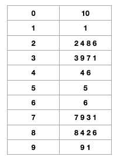

## 문제

재용이는 최신 컴퓨터 10대를 가지고 있다. 어느 날 재용이는 많은 데이터를 처리해야 될 일이 생겨서 각 컴퓨터에 1번부터 10번까지의 번호를 부여하고, 10대의 컴퓨터가 다음과 같은 방법으로 데이터들을 처리하기로 하였다.

1번 데이터는 1번 컴퓨터, 2번 데이터는 2번 컴퓨터, 3번 데이터는 3번 컴퓨터, ... ,

10번 데이터는 10번 컴퓨터, 11번 데이터는 1번 컴퓨터, 12번 데이터는 2번 컴퓨터, ...

총 데이터의 개수는 항상 $a^b$개의 형태로 주어진다. 재용이는 문득 마지막 데이터가 처리될 컴퓨터의 번호가 궁금해졌다. 이를 수행해주는 프로그램을 작성하라.

## 입력

입력의 첫 줄에는 테스트 케이스의 개수 T가 주어진다. 그 다음 줄부터 각각의 테스트 케이스에 대해 정수 a와 b가 주어진다. (1 ≤ a < 100, 1 ≤ b < 1,000,000)

## 출력

각 테스트 케이스에 대해 마지막 데이터가 처리되는 컴퓨터의 번호를 출력한다.

</br>

---

</br>

이 문제를 처음 봤을 때는 $a^b$ 를 10으로 나눈 나머지를 구하면 되겠다 라고 단순하게 생각했다. 그래서 아래와 같은 풀이를 작성했고, 그 결과는 시간 초과였다. 수가 너무 커질 경우 제한 시간 안에 풀 수가 없기 때문이다. 물론 이 이유 외에도 10은 10의 결과를 가져와야 하는데, 아래에서는 0을 가져온다는 문제점도 존재했다.

```python
T = int(input())
for _ in range(T):
    a, b = map(int, input().split())
    print(a**b % 10)
```


이 때 조금 더 고민해봤으면 아래와 같은 규칙을 스스로 생각해낼 수 있었을텐데, 백준에서 문제를 푸는게 처음이라 알고리즘이 아닌 다른 실수를 하지 않았을까 라는 생각에 다른 분들의 풀이를 먼저 보게 되었다. 다른 분들의 풀이를 보고나자 충분히 풀 수 있는 문제였는데, 답을 봤다는 사실이 많이 아쉬웠다. 예전에 프로그래머스로 알고리즘을 연습할 때도 이렇게 쉽게 풀이를 보진 않았는데.. 다음 달에 코딩 테스트를 본다는 사실 때문에 많이 마음이 조급했던 것 같다. 쨋든 사담은 뒤로하고 다시 문제로 돌아와보자.

</br>

1부터 9까지의 수를 거듭제곱하여 10으로 나눴을 때 1의 자리 값이 아래 표와 같이 규칙적인 형태를 갖는다. 이 규칙을 이용하면 시간 초과에 걸리지 않고 문제를 풀 수 있다.



a는 1부터 100 미만의 수로 10으로 나눈 나머지를 이용하면 된다. 먼저 a를 10으로 나눈 나머지인 0, 1, 5, 6의 경우 어떤 수를 거듭제곱하더라도 값은 a와 같다. 다음으로 4와 9는 2개의 수가 규칙으로 나오고, 2, 3, 7, 8은 4개의 수가 규칙적으로 나온다. 따라서 4와 9는 2로 나눴을 때 나머지 값을 이용하고, 2, 3, 7, 8을 4로 나눴을 때 나머지 값을 이용하면 실제로 거듭제곱을 b만큼 하지 않아도 답을 알 수 있다.

</br>

> 풀이 1

```python
num = int(input())
list = [[10], [1], [6, 2, 4, 8], [1, 3, 9, 7], [6, 4], [5], [6], [1, 7, 9, 3], [6, 8, 4, 2], [1, 9]]

for _ in range(num):
    a, b = map(int, input().split())
    a = a % 10

    if a == 0 or a == 1 or a == 5 or a == 6:
        print(list[a][0])
    elif a == 4 or a == 9:
        print(list[a][b%2])
    else:
        print(list[a][b%4])
```

</br>

> 풀이 2

```python
t = int(input())
for _ in range(t):
    a, b = map(int, input().split())
		a = a % 10

		if a == 0:
				print(10)
		elif a == 1 or a == 5 or a ==6:
				print(a)
		elif a== 4 or a == 9:
				b = b % 2
				if b == 1:
						print(a)
				else:
						print((a*a) % 10)
		else:
				b = b % 4
				if b == 0:
						print((a**4) % 10 % 10 % 10)
				else:
						print((a**b) % 10 % 10 % 10)
```

</br>
</br>

# Ref.

- [1009번: 분산처리](https://www.acmicpc.net/problem/1009)

- [[백준] 1009번 분산처리 파이썬 코드](https://songsw.tistory.com/26)

- [#199 백준 파이썬 [1009] 분산 처리](https://claude-u.tistory.com/248)