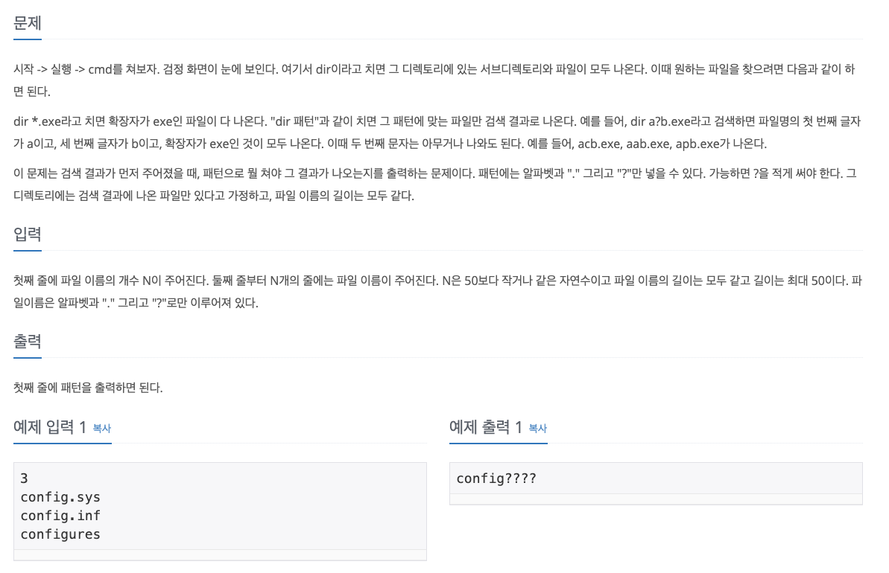

# 1032번 명령 프롬프트



</br>

입력을 여러 번 해야 한다면 입력을 한 번에 다 받아야 된다고 생각했다. 그래서 파일 이름들을 한 번에 다 입력을 받아 리스트에 넣었다. 그 뒤에 첫 번째 파일과 두 번째 파일을 비교하여 문제의 규칙대로 서로 다르다면 ?로 바꿔서 answer에 저장했다. 파일이 2개라면 한 번만 비교하면 되므로 방금 작성한 answer가 답이 되고, 만약 파일이 3개 이상이라면 answer와 그 다음 파일 이름을 비교해 다른 부분만 answer에 덮어쓰는 방식으로 새로운 answer를 만들어냈다.

> 내 풀이

```python
n = int(input())
array = []
for _ in range(n):
    array.append(input())

answer = []
if n == 1:
    print(array[0])
else:
    for j in range(len(array[0])):
        if array[0][j] == array[1][j]:
            answer.append(array[0][j])
        else:
            answer.append("?")

if n == 2:
    print("".join(answer))
else:
    for i in range(n-2):
        for j in range(len(array[0])):
            if answer[j] == array[2+i][j]:
                pass
            else:
                answer[j] = "?"
    print("".join(answer))
```

</br>

문제를 맞춘 후에 다른 사람의 풀이를 검색했는데, 아래처럼 내 코드에 비해 훨씬 더 간결했다. answer를 첫 번째 입력으로 설정하고 그 다음 입력부터 반복문을 통해 비교를 하면서 answer와 입력과 다른 값에만 ?로 업데이트를 하면 n의 개수를 고려하지 않아도 되므로 훨씬 간결해지는 것이었다.

> 다른 사람의 풀이

```python
n = int(input())
a = list(input())
a_len = len(a)
for i in range(n - 1):
    b = list(input())
    for j in range(a_len):
        if a[j] != b[j]:
            a[j] = '?'
print(''.join(a))
```

</br>

그래서 다른 사람의 풀이를 참고해서 내 코드를 수정했더니 입력은 한 번에 받으면서 훨씬 더 간결한 풀이를 완성할 수 있었다. 그렇지만 굳이 입력을 한 번에 받을 필요는 없으니 사실 위 풀이처럼 하는 것이 더 깔끔해보인다.

> 위 풀이를 바탕으로 내 코드를 수정

```python
n = int(input())
array = []
for _ in range(n):
    array.append(input())

answer = list(array[0])
for i in range(n - 1):
    for j in range(len(answer)):
        if answer[j] != array[i+1][j]:
            answer[j] = '?'
print(''.join(answer))
```

</br>

# Ref.

- [1032번: 명령 프롬프트](https://www.acmicpc.net/problem/1032)

- [[백준] 1032번(python 파이썬)](https://pacific-ocean.tistory.com/155)