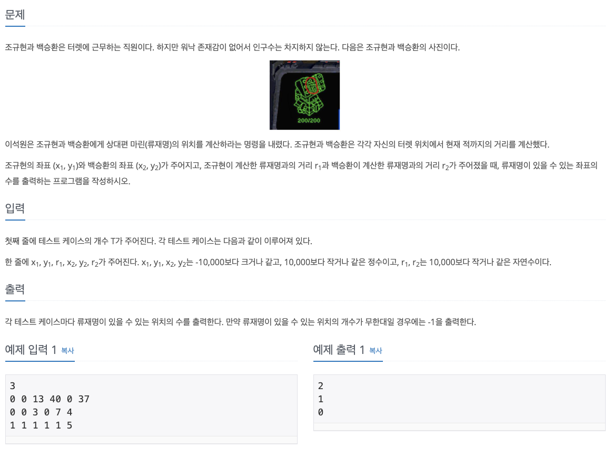
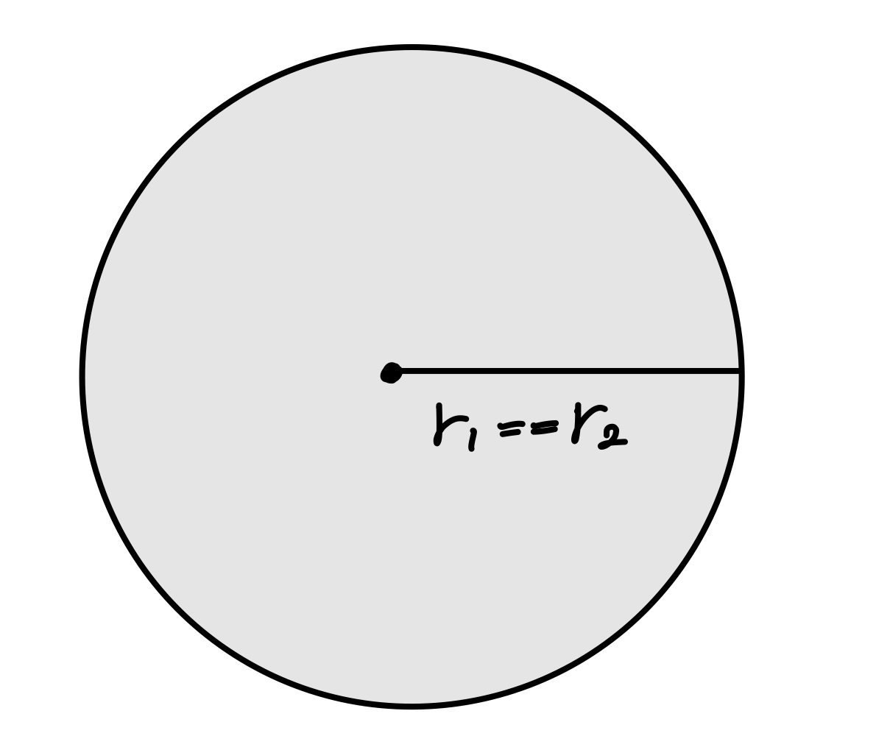
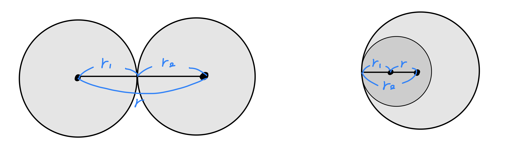
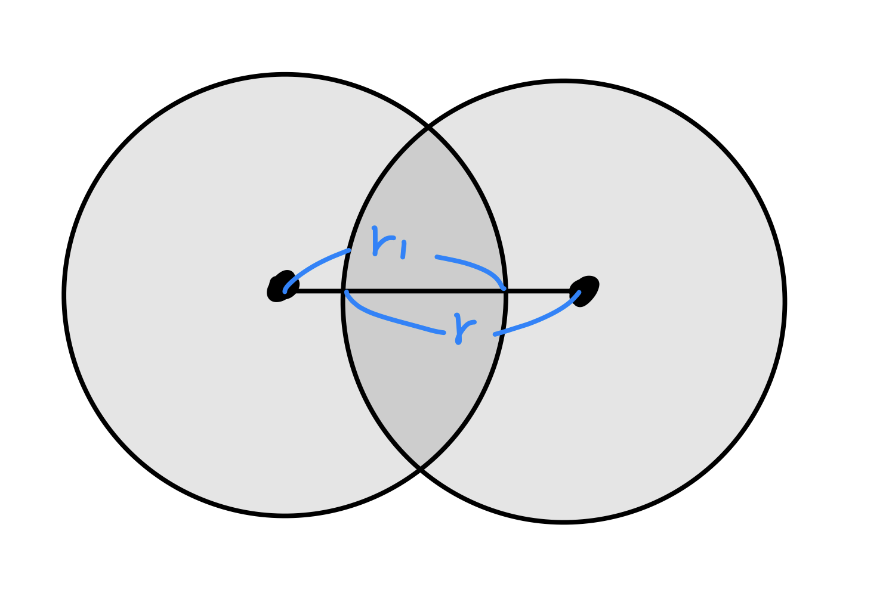
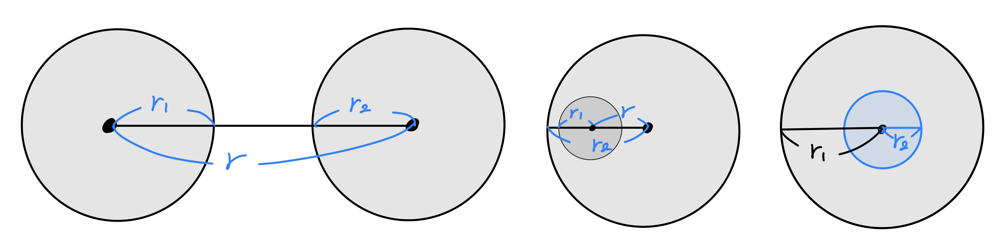

# 터렛



</br>

1. 두 원이 일치하는 경우 `r==0 and r1==r2` ⇒ -1을 출력

    


2. 두 원이 한 점에서 만나는 경우 `(r==r1+r2) or (r==|r1-r2|)` ⇒ 1을 출력

    


3. 두 점 사이의 거리가  r1 + r2보다 작으면서 | r1 + r2|보다 큰 경우 ⇒ 2를 출력

    


4. 두 점 사이의 거리가 r1 + r2보다 크거나 r2-r1보다 작을 경우 ⇒ 0을 출력

    두 점 사이의 거리가 0이지만(=원의 중심 위치가 같지만) r1 ≠ r2 ⇒ 0을 출력

    

</br>

> 참고 풀이

```python
t = int(input())
for i in range(t):
    x1, y1, r1, x2, y2, r2 = map(int, input().split())
    
    # 두 점 사이의 거리
    r = ((x2 - x1) ** 2 + (y2 - y1) ** 2) ** 0.5
    
    rs = r1 + r2
    rm = abs(r1 - r2)
    
    if r == 0:
        if r1 == r2:
            print(-1)
        else:
            print(0)
    else:
        if r == rs or r == rm:
            print(1)
        elif r < rs and r > rm:
            print(2)
        else:
            print(0)
```

</br>

# Ref.

- [1002번: 터렛](https://www.acmicpc.net/problem/1002)

- [백준 알고리즘 1002번(python 파이썬)](https://pacific-ocean.tistory.com/106)

- [[백준] 1002번 : 터렛 in python 파이썬 코드 및 설명](https://leedakyeong.tistory.com/entry/%EB%B0%B1%EC%A4%80-1002%EB%B2%88-%ED%84%B0%EB%A0%9B-in-python-%ED%8C%8C%EC%9D%B4%EC%8D%AC-%EC%BD%94%EB%93%9C-%EB%B0%8F-%EC%84%A4%EB%AA%85)

- [파이썬 코딩 도장](https://dojang.io/mod/page/view.php?id=2393)