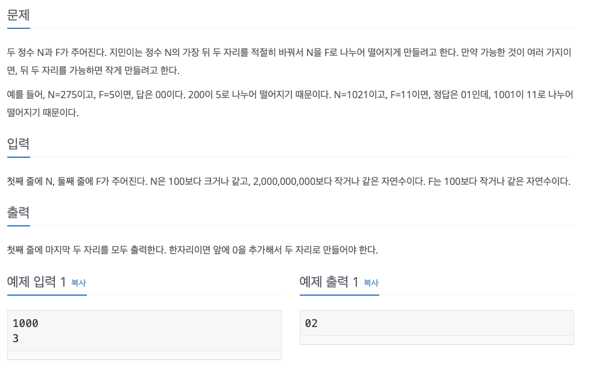

# 나누기



</br>

이번 문제는 처음에는 배수판정법과 같은 수학적인 규칙을 찾아야 하는지 알고 조금 돌아왔는데, 결국은 쉽게 풀었다. 단순하게 일단 나누어지는 수 중에서 제일 작은 수 N을 만들어야 하므로 N의 가장 뒤 두 자리를 00으로 만들어서 가장 작은 수를 만들었다. 그리고 이를 F로 나눴을 때 나누어진다면 00을 출력하면 되고, 나누어지지 않는다면 몫에 1을 더해서 F로 곱한 것이 나누어지는 수 중에서 가장 작은 수이므로 그 수의 마지막 두 자리를 출력하면 된다. 

> 내 풀이

```python
n = list(input())
f = int(input())

n[-1] = "0"
n[-2] = "0"
min_n = int("".join(n))

if min_n % f == 0:
    print("00")
else:
    x = (min_n // f + 1) * f
    print(str(x)[-2:])
```

</br>

다른 사람 풀이를 참고했을 때, 알고리즘은 거의 동일했다. 하지만 뒤 두 자리를 더 간단하게 바꿀 수 있는 풀이가 있었다. 나는 N의 맨 뒤 두자리를 0으로 만들기 위해서 input을 받아 리스트로 만들고 이를 join으로 다시 붙이는 등의 작업을 거쳤다. 이렇게가 아니라 input으로 받으면 타입이 string이므로 이때 **슬라이스**를 이용해서 뒤 두자리를 자르고 00을 붙이면 훨씬 간단하게 만들 수 있었다.


> 다른 사람 풀이
```python
n = input()
f = int(input())
a = int(n[:-2] + '00')
while True:
    if a % f == 0:
        break
    a += 1
print(str(a)[-2:])
```

</br>

# Ref.

- [1075번: 나누기](https://www.acmicpc.net/problem/1075)

- [백준 알고리즘 1075번(python 파이썬)](https://pacific-ocean.tistory.com/109)