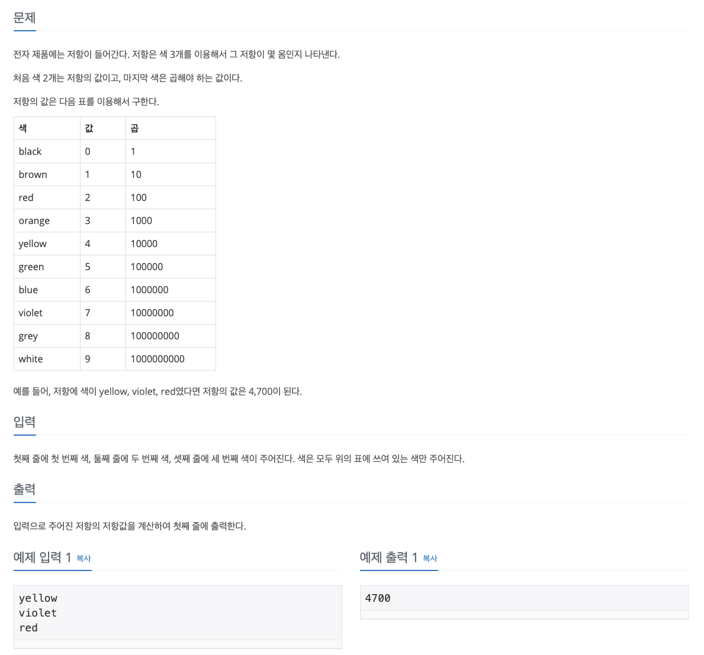

# 저항



</br>

처음에는 이중리스트나 dict로 문제의 표를 하나 만들까 했다. 근데 출제의도가 그게 아닐꺼라는 생각이 들어서 따로 색, 값, 곱 리스트를 만들어서 zip으로 합쳐 하나의 리스트를 만들어서 풀었다. 근데 다른 사람의 풀이를 찾아보니까 그것보다도 **값은 index, 곱은 10의 거듭제곱**으로 풀면 된다는 것을 아는게 핵심인 듯 했다. 그래서 풀긴 풀었지만, 너무 돌아서 푼 느낌이라 아쉬운 문제였다. 그렇기에 푸는 것만으로 끝내지 않고 다른 풀이도 찾아보는 것이 역시 좋다라는 걸 한 번 더 느꼈다.

> 내 풀이

```python
color, color2, color3 = [input() for _ in range(3)]

color_list = ["black","brown", "red", "orange", "yellow", "green", "blue", "violet", "grey", "white"]
value_list = [i for i in range(len(color_list))]
multiply = 1
mul_list = [1]
for i in range(len(color_list)-1):
    multiply = multiply * 10
    mul_list.append(multiply)

resistance = list(zip(color_list, value_list, mul_list))
color_idx = color_list.index(color)
color2_idx = color_list.index(color2)
color3_idx = color_list.index(color3)
values = str(resistance[color_idx][1]) + str(resistance[color2_idx][1])
answer = int(values) * resistance[color3_idx][2]
print(answer)
```

</br>


> 다른 사람 풀이1

```python
color = ['black', 'brown', 'red', 
'orange', 'yellow', 'green', 'blue', 'violet', 'grey', 'white']
f = color.index(input())
s = color.index(input())
t = color.index(input())
r = int(str(f) + str(s)) * (10 ** t)
print(r)
```

</br>


> 다른 사람 풀이 2 ⇒ dict 활용

```python
dic = {'black': [0,1], 'brown': [1,10], 'red': [2,100], 'orange': [3,1000], 'yellow': [4,10000],
     'green': [5,100000], 'blue': [6,1000000], 'violet': [7,10000000], 'grey': [8,100000000],
     'white': [9,1000000000]}
li = []

for i in range(3):
    li.append(input())
print(int(str(dic[li[0]][0]) + str(dic[li[1]][0])) * dic[li[2]][1])
```

</br>


# Ref.

- [1076번: 저항](https://www.acmicpc.net/problem/1076)

- [[백준] 1076번(python 파이썬)](https://pacific-ocean.tistory.com/164)

- [백준 알고리즘 1076번 저항(python)](https://jinho-study.tistory.com/19)