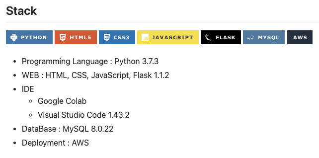
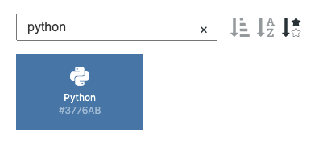

GitHub의 README 파일은 Repository 즉, 내 프로젝트를 확인할 때 가장 먼저 확인할 수 있는 공간으로 가독성있게 작성하는 것이 중요하다. 개인적으로 badge를 사용하면 가독성도 좋고, 깔끔하게 나의 프로젝트에 대해서 소개할 수 있다고 생각해 badge를 만들 수 있는 사이트인 [shields.io](http://shields.io) 사용법에 대해 기록하고자 한다.

# shields.io

[shields.io](http://shields.io/) 사이트를 접속해서 badge를 생성하고자 하는 repository의 url을 추가하면 badge를 자동적으로 추천받을 수 있다. 하지만 이 경우 issues, forks, stars 등과 관련된 badge만 추천되기 때문에 간단한 프로젝트의 badge를 생성하는데는 도움이 되지 않는다. 😂

하지만 기본으로 제공되는 badge 외에도 커스텀해서 badge를 제작할 수 있다. 예를 들어서, 아래 사진처럼 프로젝트에 사용된 기술들을 작성할 때 badge를 이용하면 훨씬 예쁘게 작성할 수 있다.



# Custom badge 만들기

위 예시처럼 Custom badge를 만드는 방법은 아래와 같다.

```markdown

```

> python badge 만들기


- 기술명 : Python
- 원하는 색상 코드 : 3776AB
- 아이콘 : Python
- 로고색상 : White

```markdown

```

### 아이콘과 색상코드

기술의 로고명과 색상코드는 [simpleicons](https://simpleicons.org/) 사이트에서 확인할 수 있다. 이 사이트에서 제공되는 로고 아이콘은 shield.io에서 다 사용 가능하다고 한다.

> python을 검색하면 로고명은 Python이고, 해당 색상은 3776AB 라는 것을 알 수 있다.



</br>

# Ref.

- [Shields.io: Quality metadata badges for open source projects](https://shields.io/)

- [Simple Icons](https://simpleicons.org/)

- [Shield IO 사용법](https://velog.io/@loakick/Shield-IO-%EC%82%AC%EC%9A%A9%EB%B2%95-iojyndy4pi)
