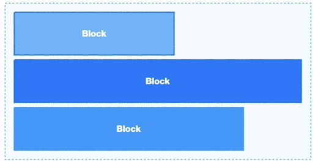
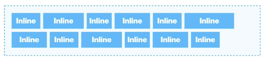
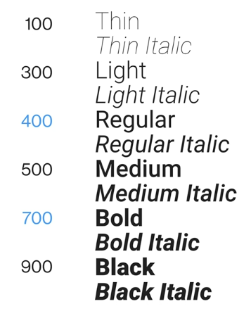

### CSS 공부한 내용을 나중에 찾아보기 쉽게 정리했습니다. CSS 개념 정리는 이 포스트에 계속 업로드하고 있습니다.

</br>
</br>

---

# CSS

- [CSS](#CSS)
- [Selectors](#Selectors)
    - [Type, Class & ID Selector](#Type,-Class-&-ID-Selector)
        - [Type Selector](#Type-Selector)
        - [Class Selector](#Class-Selector)
        - [ID Selector](#ID-Selector)
    - [Child, Descendant & Sibling Combinators](#Child,-Descendant-&-Sibling-Combinators)
        - [Child](#Child)
        - [Descendant](#Descendant)
        - [Sibling Combinators](#Sibling-Combinators)
    - [Structural Pseudo-classes](#Structural-Pseudo-classes)
        - [element:first-child](#element:first-child)
        - [element:last-child](#element:last-child)
        - [element:nth-child(n)](#element:nth-child(n))
    - [Structural Pseudo-classes](#Structural-Pseudo-classes)
        - [User Action Pseudo-classes](#User-Action-Pseudo-classes)
    - [CSS 선택자 우선순위](#CSS-선택자-우선순위)
- [Box](#Box)
    - [Box Model](#Box-Model)
    - [Box Sizing](#Box-Sizing)
    - [Box](#Box)
        - [Block](#Block)
        - [Inline](#Inline)
        - [Inline Block](#Inline-Block)
        - [Flex](#Flex)
- [Float](#Float)
- [Position](#Position)
    - [static](#static)
    - [relative](#relative)
    - [absolute](#absolute)
    - [fixed](fixed)
    - [sticky](sticky)
- [Flex Box](#Flex-Box)
- [Media Query](#[Media-Query)
- [Typography](#Typography)
- [Background](#Background)
- [Transtion](#Transtion)
- [Animation](#Animation)
- [etc](#etc)

</br>

---

</br>

# CSS란
## CSS

Cascading Style Sheet

</br>

## Syntax

```css
selector {
	property: value;
}
```

- ### selector 선택자

    HTML 요소를 꾸미기 위해 해당 요소를 선택하는 것

- ### `{ }` 선언부

    1. property 속성
    2. value 속성에 따른 값
    3. ; 세미콜론 ⇒ , 콤마의 역할

</br>
</br>

## CSS 사용방법

1. **추천 방법** : HTML 파일에서 CSS 파일 link 하기

    ```html
    <html>
    	<head>
    		<title>How to use CSS</title>
    		<link rel="sytlesheet" href="./style.css" />
    		....
    ```

2.  HTML 안에서 style 태그 만들기

    ```html
    <html>
    	<head>
    		<title>How to use CSS</title>
    		<style>
    		/* css */
    		</style>
    		...
    ```
    > **HTML에 Style을 적용하면 안되는 이유** </br> : HTML에 웹에 관한 정보 외에 너무 많은 정보가 포함되고, 스타일을 유지보수, 수정하는 것도 어려움


3. inline 스타일로 작성

    : HTML 파일에서 CSS를 유지 보수해야 하기 때문에 아주 특별한 경우 외에는 사용 금지

    ```html
    <p style="font-size: 32px;">
    	<!-- 내용 -->
    </p>
    ```

</br>
</br>

---

</br>
</br>

# Selectors

```css
**selector** {
	property: value;
}
```

## 요소, 클래스, ID 선택자 (Type, Class & ID Selector)

### Type Selector

HTML 태그 자체를 지칭해서 스타일을 줄 때

```css
h1 {
	color : #0066ff;
}
```
</br>

### Class Selector

여러 개의 요소에 같은 스타일을 적용하고 싶다면 같은 class를 사용하면 유용

```html
<div class="box"> </div>
```

```css
.box {
	backgroun-color: blue;
}
```

> class는 여러 개를 가질 수 있음

- 하나의 박스이지만 클래스는 box-0, box-1, box-2 총 3개를 가지고 있음

```html
<div class="box-0 box-1 box-2"> </div>
```

- box-0이면서 box-1의 클래스를 가지고 있는 경우

    .box-0.box-1 ⇒ 이렇게 띄어쓰기를 하지 않고 붙여 써야 됨

```css
.box-0.box-1 {
	backgroun-color: red;
}
```
</br>

### ID Selector

ID는 단 하나만 존재할 수 있음 ⇒ 중복 사용 불가능

```html
<div id="box"> </div>
```

```css
#box {

}
```

</br>


## 자식, 자손, 형제 선택자 (Child, Descendant & Sibling Combinators)

```html
<section>
	<h1> </h1>
	<ul>
		<li>
			<h1> </h1>
			<p> </p>	
		</li>
		<li> </li>
	</ul>
</secton>
```

- section의 자식은 h1, ul이고, li는 section의 자식은 아니지만 section의 자손이고  ul의 자식이다.
- li 안에 있는 h1과 p는 li의 자식이고, h1과 p는  서로 형제이다
- 자손 안에는 모든 자식이 해당 되기에 모든 자식은 자손이다.

</br>

### Child 자식 선택자

parent > child

⇒ parent 중에서 해당하는 child를 선택하기 위해 >를 사용

- section의 자식인 h1만 선택

```css
section > h1 {
	color: red;
}
```
</br>

### Descendant 자손 선택자

parent descendant

⇒ parent 안에서 해당하는 descendant를 선택하기 위해 사이에 공백을 사용

- section의 모든 h1을 선택

```css
section h1 {
	color: blue;
}
```
</br>

### Sibling Combinators 형제 선택자

```html
<section>
	<h1>Sibling combinators</h1>
	<ol>
		<li>Do something</li>
		<li class="active">Do something else</li>
		<li>Create something</li>
		<li>Create something else </li>
		<li>Make something</li>
		<li>Make something else</li>
	</ol>
</secton>
```

```css
.active {
	font-weight: 700;
}
```

- **parent ~ sibling**

    active 클래스를 기준으로 그 다음 형제 요소인 li에게 스타일을 적용하고 싶을 때

    ```css
    .active ~ li {
    	color: blue;
    }
    ```

- **parent + sibling**

    active 클래스를 기준으로 그 다음 요소 하나에만 스타일을 적용하고 싶을 때

    ```css
    .active + li {
    	color: red;
    }
    ```

</br>


## 구조적 가상 클래스 선택자 (Structural Pseudo-classes)

어떤 상태나 조건을 만족할 때 사용하는 클래스

```html
<section>
	<h1>Structural Pseudo-classes</h1>
	<ol>
		<li>Do something</li>
		<li>Do something else</li>
		<li>Create something</li>
		<li>Create something else </li>
		<li>Make something</li>
		<li>Make something else</li>
	</ol>
</secton>
```
</br>

### element:first-child

첫 번째 요소일 때 사용 가능

- 첫 번째 li인 Do something을 선택하고 싶을 때

    ```css
    li:first-child {
    	color: #0066ff;
    ]
    ```
</br>

### element:last-child

마지막 요소일 때 사용 가능

- 마지막 li인 Make something else을 선택하고 싶을 때

    ```css
    li:last-child {
    	color: #ffc82c;
    ]
    ```
</br>

### element:nth-child(n)

중간 요소일 때 사용 가능

- 중간 li인 Create something을 선택하고 싶을 때

    ```css
    li:nth-child(3) {
    	color: #ff4949;
    ]
    ```

- 짝수 : element:nth-child(2n)
- 홀수 : element:nth-child(2n-1)

</br>
</br>

## 구조적 가상 클래스 선택자 (Structural Pseudo-classes)

### User Action Pseudo-classes

유저의 액션에 따라 상태가 변하는 선택자

-  element:hover

    : 마우스를 올려 두면 변화가 생김

    ```css
    a:hover {
	    background-color: red;
    }
    ```

- element:active

    : 누르는 찰나의 순간에 변화가 생김

    ```css
    a:active {
    	background-color: yello;
    }
    ```

-  element:focus

    요소가 클릭이 되었을 때 강조해주는 효과

    ex. input처럼 무언가를 넣는 창을 클릭할 때 그 창을 강조해줌

    ```css
    input:focus {
    	border-color: blue;
    }
    ```

> (+) focus와 active를 같은 요소에 적용할 수 있는데, 그 경우 유저가 클릭한 순간에는 active의 효과가 적용되고, > 그 이후부터는 focus의 효과가 적용된다.

</br>
</br>

## CSS 선택자 우선순위
✅ 기본적으로 CSS는 나중에 선언된 것이 기존에 선언된 것을 덮어 씀

**ID > Class, Pseudo-class > Type**

⇒ Class, Pseudo-class, Type이 아무리 많아도 ID 하나의 우선순위가 더 높다

⇒ ID, Class, Pseudo-class, Type의 개수가 같다면 총 개수로 비교

</br>


### CSS의 규칙과 상관없이 우선순위가 되는 경우 😈

1. Inline Style

    : HTML 태그 안에 스타일 속성을 적용하는 것

2. important 선언

    : CSS 속성에서 important 선언을 하면 inline style보다도 우선순위가 됨

    ```css
    p {
    	color: red !important;
    }
    ```

 > ⇒ 기존 규칙을 깨는 아이들이기 때문에 가급적이면 사용 자제하기

</br>
</br>

---

</br>
</br>

# Box
## Box Model

HTML의 모든 요소들은 CSS로 표현될 때 박스로 표현된다


- Content

    가로는 width, 세로는 height

-  Padding

    안쪽 여백, 즉 content와 border 사이의 공간을 나타냄

- Border

    테두리를 나타냄

    ```css
    border: 굵기 스타일 색상
    ```

     ⇒ 순서는 상관없지만, 꼭 명시해야 함

     - `border : none;` ⇒ 테두리가 필요 없을 때
     - `border-radius: ~px;` ⇒ 테두리를 둥글게 만들고 싶을 때
     - `border-radius: 50%;` ⇒ 원 모양

- Margin

    바깥 여백, 즉 요소와 요소 사이의 간격을 나타냄

    속기형 shorthand로 적을 때 ⇒  top right bottom left 시계 방향으로 적기 (+) 상하, 좌우 세트로 적용됨

---

## Box Sizing


css의 box-sizing의 기본값은 content-box이지만 이를 border-box로 수정하면 사이즈를 정할 때 border-box를 기준으로 정하게 됨

```css
* {
	box-sizing: border-box;
}
```

> ⇒ 이렇게 하면 500px의 정사각형을 만들고 패딩을 20px씩 주어도 content-box가 자동으로 420px만큼으로 지정되고, > 패딩이 20px씩 4번해서 정사각형의 총 크기는 여전히 500px이 된다

---

## Box

- Box Type → Box model

    Box Type에 따라 Box model이 정해진다

- Box Type → Display

    Display에 따라 Box Type을 결정해야 한다

> ✅  Block : 면(영역) / Inline : 선(흐름)

</br>

### Block



- Block은 따로 width를 선언하지 않은 경우, **width = 부모의 content-box의 100%**

    따로 width를 선언한 경우, 남은 공간은 **자동으로 margin으로 채움** 

    ⇒ Block 박스의 경우, 옆에 다른 박스가 올 수 없음

- 따로 부모의 height를 선언하지 않을 경우, **자식 요소의 height의 합 = 부모의 height**
- block 타입은 Box model의 모든 속성(width, height, padding, border, margin)을 다 사용할 수 있음

> 💡 css를 통해 가운데 정렬을 할 때 margin: 0 auto; ⇒ 0 auto : 상하 margin은 0이고,  좌우 margin은 사이좋게 나눠 가진다 라는 뜻

</br>

### Inline



한 줄 안에 옆으로 계속 쓸 수 있다는 특징! (block과는 정반대)

만약 한 줄 안에 다 쓸 수 없다면 줄바꿈을 통해 계속 흐를 수 있도록 함 ⇒ 문서 작성과 똑같음

❗️ Box model의 속성 중 **width, height, padding-top, padding-bottom, border-top, border-bottom, margin-top, margin-bottom 사용 불가**

⇒ Inline의 흐름을 박살내는 속성이기 때문

</br>

### Inline Block

Inline에 Block의 능력을 갖고 있음

⇒ Inline처럼 기본적으로는 흐르지만, Block처럼 영역도 잡을 수 있음

</br>

### Flex

[Flex Box 참고](#Flex-Box)
</br>
</br>

---
</br>
</br>

# Float

Float는 Block 요소들을 가로 배치하기 위해서 사용

</br>

## Float를 사용하면 무슨 일이?

1. 부모가 가지고 있던 자식이 Float가 되면, Float된 자식은 없는 자식 취급을 받음 

    ⇒ 부모와 형제는 집 나간 자식의 위치를 알 수 없게 된다.

2. float된 요소는(inline, inline block, block) 모두 Block이 된다.

    ⇒ inline은 Box model의 속성 중 width, height, padding-top, padding-bottom, border-top, border-bottom, margin-top, margin-bottom 사용 못하지만, float를 적용하면 block이 되기 때문에 box model의 모든 속성을 다 사용할 수 있게 된다.

3. Block이지만 길막을 하지 못하는 Block이 된다.

    ⇒ Block은 따로 width를 선언하지 않은 경우, width = 부모의 content-box의 100%인데, float된 Block은 콘텐츠의 크기 만큼의 width를 갖게 된다.

    ⇒ Block은 따로 width를 선언한 경우, 남은 공간은 자동으로 margin으로 채우는데, float된 Block은 자동으로 생기는 margin이 사라지기 때문에 그 빈 공간에 다른 float된 Block이 올 수 있게 된다 ⇒ 이러한 방식으로 가로 배치가 가능하다

    ⇒ float된 요소들이 많아서 부모의 width를 넘어가면 자동으로 다음 줄로 넘어간다

    ❗️ 부모가 가지고 있는 모든 자식들이 float된다면 부모의 height는 0이 된다.


4. Block 요소들은 float된 요소들을 없는 요소 취급하지만, inline 요소들은 float를 인식한다

---

### 이를 고치기 위해

- overflow: hidden;

    float된 자식을 가지고 있는 부모에게 overflow:hidden을 주게 되면 float된 자식을 찾게 된다

 - Clearfix

    clear는 float로 망가진 레이아웃을 고치기 위한 것

    ```css
    clear: left | right | both;
    ```

    ⇒ Block 요소들은 float된 요소들을 없는 요소 취급하지만, clear를 적용하면 float된 요소들을 인식할 수 있게 된다.  예를 들어, Block에 clear:left를 적용하면 float:left가 된 요소의 위치를 정확하게 인식하게 된다.

    ⇒ float의 위치를 제대로 인식하게 되면, 부모의 height가 float된 요소들을 무시하지 않아 float요소를 포함한 전체   크기가 되기 때문에 레이아웃이 망가지지 않게 된다

    모든 요소가 float되면 부모의 height는 0이 되는데, 이 때 레이아웃이 붕괴되는 것을 막기 위해 보통 의미없는 div를  하나 만들어 clear 속성을 주는데 이렇게 하면 HTML을 건들여야 하는 문제점(?)이 발생

    ⇒ Pseudo-Element를 만들어서 clear 속성 적용하기

    ```css
    .parent::after {
    	content: "";
    	display: block;
    	clear: both;
    	/* left | right | both */
    }
    ```

- Pseudo-Element

    HTML을 건들이지 않고 CSS에서 문제를 해결하기 위해 HTML에는 존재하지 않는 가상 요소를 만드는 방법으로 display가 Block인 요소에만 적용이 가능

    가상 요소는 2가지를 만들 수 있다

    - `.pseudo::before`  요소의 맨 앞

    - `.pseudo::after`  요소의 마지막

    💡 clear를 적용하기 위해 필요한 요소마다  `::after` 를 적용해 가상 요소를 만들기 귀찮기 때문에 범용으로 쓸 수 있는 `.  clearfix::after {content: ""; display: block; clear: both;}` 를 만들고 float를 적용할 때마다  해당하는 부모의 HTML 태그에 clearfix 클래스를 추가하기

</br>
</br>

---

</br>
</br>

# Postion
## Position

`position: static | relative | absolute | fixed | sticky;`

</br>

### static

모든  요소에서 position의 기본 값

</br>

### relative

이동의 기준점 = 자기 자신이 본래 있던 자리

⇒ 자신의 원래 위치를 기억하고, 부모와 형제도 relative된 자식의 위치를 기억하기에 레이아웃이 망가지지 않음

```html
.box {
	position: relative;
	top: 20px;
	right: 20px;
}
```

⇒ top이면 위를 기준으로 20px을 움직이기에 밑으로 움직이는 것처럼 보이고, right은 오른쪽을 기준으로 움직이기에 box가 왼쪽으로 움직인 것처럼 보인다 

</br>

### absolute

- **float와 공통점**
1. 부모가 가지고 있던 자식이 absolute 되면, absolute된 자식은 없는 자식 취급을 받음 

    ⇒ 부모와 형제는 집 나간 자식의 위치를 알 수 없게 된다.

2. absolute된 요소는(inline, inline block, block) 모두 Block이 된다.

    ⇒ inline은 Box model의 속성 중 width, height, padding-top, padding-bottom, border-top, border-bottom, margin-top, margin-bottom 사용 못하지만, absolute를 적용하면 block이 되기 때문에 box model의 모든 속성을 다 사용할 수 있게 된다.

3. Block이지만 길막을 하지 못하는 Block이 된다.

    ⇒ Block은 따로 width를 선언하지 않은 경우, width = 부모의 content-box의 100%인데, absolute된 Block은 콘텐츠의 크기 만큼의 width를 갖게 된다.

    ⇒ Block은 따로 width를 선언한 경우, 남은 공간은 자동으로 margin으로 채우는데, absolute된 Block은 자동으로 생기는 margin이 사라지기 때문에 그 빈 공간에 다른 absolute된 Block이 올 수 있게 된다 ⇒ 이러한 방식으로 가로 배치가 가능하다

    ⇒ absolute된 요소들이 많아서 부모의 width를 넘어가면 자동으로 다음 줄로 넘어간다

    ❗️ 부모가 가지고 있는 모든 자식들이 absolute된다면 부모의 height는 0이 된다.

- **float와 다른 점**

    : inline 요소들도 absolute된 아이들을 인식하지 못한다 (float의 경우에는 인식함)

- **absolute의 기준점** = 직접 정할 수 있음

    자기를 감싸고 있는 모든 조상 중에서 `positon: static;` 이 아닌 요소 중에서 정할 수 있음

    그래서 보통 기준점으로 정하고 싶은 조상에게 `position: relative;` 를 적용함 (relative는 영향을 미치지 않기 때문)

</br>

### fixed

`position: absolute;` 와 동일한 현상이 일어남

**fixed의 기준점** = viewport(브라우저 창의 전체 크기)

⇒ 스크롤을 해도 viewport의 위치에 맞게 항상 같은 위치에 고정됨

</br>

### sticky

아직 지원하는 브라우저가 많지 않다

-  top, bottom, left, right

    **top, bottom 둘 중에 하나**, **left와 rigth 둘 중에 하나**만 사용하는게 정신 건강에 좋음

-  z-index

    postion된 요소들의 수직 방향의 우선순위

    z-index 숫자가 높을수록 더 위에 있다는 뜻 ⇒ z-index 숫자가 낮은 요소들을 가릴 수 있다는 의미

</br>
</br>

---

</br>
</br>

# Flex Box
## Flex Box
### 1.  `display: flex;`  선언하기

```css
.flexbox {
	display: flex;
	/* flex | inline-flex */
]
```

⇒ 정렬하고자 하는 요소를 감싸는 부모에게 `display: flex;` 값을 적용해야 한다

### 2. flex-direction

```css
.flexbox {
	display: flex;
	flex-direction: row;
	/* row | row-reverse | column | column-reverse */
]
```

- row : 가로방향 정렬
- column : 세로방향 정렬


>### Axis
>
> flex의 방향에 따라 main axis가 생기고, 이와 수직인 cross axis가 생긴다
>
>- `felx-direction:row;`  
>    main axis = 왼쪽에서 오른쪽으로 흐르는 가로선(→), cross axis = 위에서 아래로 흐르는 세로선(↓)
>- `felx-direction:column;`  
>    main axis = 위에서 아래로 흐르는 세로선(↓), cross axis = 왼쪽에서 오른쪽으로 흐르는 가로선(→)
>- `felx-direction:row-reverse;`  
>    main axis = 오른쪽에서 왼쪽으로 흐르는 가로선(←), cross axis = 위에서 아래로 흐르는 세로선(↓)
>- `felx-direction:column-reverse;`  
>    main axis = 아래에서 위로 흐르는 세로선(↑) cross axis = 왼쪽에서 오른쪽으로 흐르는 가로선(→)

</br>

### 3. flex-wrap

: 무조건 한 줄 안에 모든 요소를 정렬할 것인지, 상황에 따라 여러 줄에 정렬할 것인지

- `flex-wrap: nowrap;` 감싸지 않고 자식의 사이즈를 줄여서라도 한 줄로 정렬
- `flex-wrap: wrap;` 한 줄에 모두 정렬하기에 공간이 넉넉하지 않으면 여러 줄에 정렬

</br>

### 4. justify-content, align-items | align-contnet

- justify-content

    main axis축을 기준으로 무언가를 정렬하고 싶을 때

- align-items

    cross axis 축을 기준으로 정렬하고 싶을 때


> `center` : 가운데 정렬
> 
> `flex-start` : 흐르기 시작하는 방향을 기준으로 정렬
> 
> `flex-end` : 흐른 후의 방향을 기준으로 정렬
> 
> `space-between` : 요소들 사이에 동일한 간격
> 
> `space-around` : 요소들 주위에 동일한 간격
> 
> ❗️lign-items에서는 space-between과 space-around를 사용하지 못한다
> 
> 💡 `justify-content: center;` `align-items: center;` 를 같이 사용하면 완전 정 가운데 정렬을 만들 수 있다 ⇒ 가로축과 세로축에서 모두 가운데에 정렬한다는 뜻이므로

- align-content

    flex-wrap: wrap이면 flex line이 여러줄이 생기기 때문에 align-items가 제대로 적용하지 않는다. 따라서 이때, align-content를 사용하면 전체 큰 line을 기준으로 하기 때문에 생각했던 대로 정렬을 할 수 있다 

    💡 **먼저 align-items**를 사용하고, 이상하면 그 **다음에 align-content**를 사용하면 대부분은 해결된다

- order

    HTML의 순서가 아니라 새로운 순서를 만들 수 있다

    order의 숫자가 낮을수록 먼저 온다

</br>
</br>

---

</br>
</br>

# Media Query
- 반응형 웹 규격 참고 ⇒ [Overview](https://getbootstrap.com/docs/4.5/layout/overview/#containers)

</br>

## Media Query

Responsive Web 반응형 웹을 만들기 위해

⇒ HTML에서 viewport meta와 CSS에서 media query가 반드시 선언되어야 한다

</br>

### viewport meta

```html
<!DOCTYPE html>
<html lang="en">
  <head>
    <meta charset="UTF-8" />
    **<meta name="viewport" content="width=device-width, initial-scale=1.0" />**
```

### media query

```css
@media screen and (min-width: 768px) {
 /* Where all the magic happens... */
}
```

- min-width : 최소 가로 길이는 ~이상
- max-width : 최대 가로 길이는 ~이하

> ✅ vh와 vw
>- vh = viewport height
>
>    height: 100vh ⇒ viewport의 세로 길이 만큼 차지
>
>- vw = viewport width
>
>    width : 100vw ⇒ viewport의 가로 길이 만큼 차지

</br>
</br>

---

</br>
</br>

# Typography
</br>


## Typography

텍스트를 예쁘게 디자인 하는 것

</br>

### font-size

글자 크기를 바꿀 수 있음

- **px** 

    : 절대 단위 Absolute unit

- **em** = equal to captial M 

    : 상대 단위 Relative unit (대문자 M 사이즈의 크기를 기준으로 한다는 뜻 ⇒ 실제로 적용된 폰트 사이즈)

    ```css
    .parrent {
    	font-size: 20px
    }

    p {
    	font-size: 1.5em; /* 30px */
    }
    ```

-  rem = root em

    : 상대 단위 Relative unit

    : root = html 자체이기 때문에 rem은 html 자체에 적용된 폰트 사이즈

    ```css
    html {
    	font-size: 20px
    }

    p {
    	font-size: 3rem; /* 60px */
    }
    ```
</br>

### line-height

줄간격

line-height는 px, em, rem 다 사용 가능하지만, 주로 em을 사용한다

⇒ 줄간격은 해당 폰트 사이즈에 비례해서 정하기 때문에

line-height 크기와 상관없이 사용했을 때 text는 무조건 line-height의 가운데에 배치된다

```css
.text {
	font-size: 16px;
	line-height: 1.5;
}
```

❗️ font-size에 비례해서 line-height를 적을 때는 em을 생략하기 (px, rem은 반드시 적어야 한다)

</br>


### letter-spacing

글자와 글자 사이의 자간

letter-spacing은 px과 em을 사용한다 (em을 생략하면 안된다! 무조건 적어야 함)

</br>

### font-family

폰트 서체를 표현할 때

```css
.text {
	font-family: "Poppins"; /* Poppins 서체를 적용해줘 */
	font-family: "Poppins", sans-serif; 
	/* Poppins 서체를 적용하는데 없으면 sans-serif 중에서 아무거나 적용해줘 */
	font-family: "Poppins", "Roboto", sans-serif;
	/* Poppins 적용하고, 없으면 Roboto를 적용하고, 다 없으면 sans-serif 중에서 아무거나 적용해줘 */
}
```

</br>

### font-weight

폰트의 굵기를 변경할 때 사용

100 단위로 적용된다 ⇒ Regular 사이즈 = 400, Bold = 700



</br>

### color

글씨의 색을 적용할 때

- hex

    `.text {color: #0066ff;}`

- rgb

    `.text {color: rgb(0, 102, 255);}`

- rgba

    `.text {color: rgba(0, 102, 255, 1);}`

    마지막은 alpha 값으로 투명도를 표현함 (0이면 투명, 1이면 불투명)

</br>

### text-align

text를 정렬할 때 사용

- left : 왼쪽 정렬
- right : 오른쪽 정렬
- center : 가운데 정렬

</br>

### text-indent

들여쓰기(+), 내어쓰기(-)할 때 사용

`text-indent: 100px;` 100px만큼 들여쓰기함

</br>

### text-transform

알파벳 베이스의 글자에만 적용 가능함

- none : 기본값
- capitalize : 모든 단어의 첫 글자가 대문자가 됨
- uppercase : 모든 글자가 대문자가 됨
- lowercase : 모든 글자가 소문자가 됨

</br>

### text-decoration

텍스트의 줄을 끊을 수 있음

- none : 기본값(줄이 없음)
- underline : 밑줄
- line-through : 글자 중간에 밑줄이 생김
- overline : 글자 위에 줄이 생김

✅ a태그의 기본값이 underline이기 때문에 `text-decoration: none;` 으로 없앨 때 사용

</br>

### font-style

- normal : 기본값
- italic : *이탈릭체*
- oblique ⇒ italic이랑 거의 비슷해서 잘 안씀

✅ em태그의 기본값이 italic이기 때문에 `font-style: none;` 으로 없앨 때 사용


</br>

## Webfont ❗️

흔하지 않은 폰트를 사용할 경우 사용자에게 webfont를 제공해야 한다


👍 [Google Fonts](https://fonts.google.com)를 이용하는 방법

- html <head>

    ```html
    <link href="https://fonts.googleapis.com/css2?family=Roboto&display=swap" rel="stylesheet">
    ```

- css

    ```css
    body {
    	font-family: 'Roboto', sans-serif;
    }
    ```
</br>
</br>

---

</br>
</br>

# Background
</br>

## Background

- 배경 이미지를 넣거나
- 배경 이미지를 넣어서 버튼을 만들거나 할 때 사용

```css
.box {
	width: 100px;
	height: 100px;
	background-color: #0066ff;
	background-image: url("./assets/heart.png);
	background-repeat: no-repeat;
	background-size : cover;
	background-position: center center;
}
```
</br>

### background-color

배경색을 넣고 싶을 때 사용

hex, rgb, rgba로 표현할 수 있음

`background-color: #0066ff;`

</br>

### background-image

이미지를 넣고 싶을 때 사용

이미지의 경로를 url()에 넣어야 한다

1. 지정된 위치에서 가져오기

    `background-image: url("이미지 경로");`

2. 웹에서 이미지 주소 복사하기

    `background-image: url("이미지 주소");`

</br>

### background-repeat

`background-repeat: no-repeat;`

- repeat : 기본값
- no-repeat : 이미지의 반복을 원하지 않을 경우

</br>

### background-size

백그라운드 이미지의 사이즈를 조절

- contain : 요소 안에 이미지가 잘리지 않고 다 포함되도록
- cover : 요소 안에 빈 공간을 남기지 않고 이미지가 꽉 차도록 함(이미지가 잘릴 수 있음)
- custom : 원하는 값으로 사이즈를 설정

    ✅ `background-size: 100% auto` ⇒ 가로는 꽉 차고, 세로는 자동으로

</br>

### background-position

`background-position: x y;`

x(x축)와 y(y축) 값에는 center, top, bottom, px, % 등 다양하게 사용 가능

✅ 보통은 가운데 정렬을 많이 하기 때문에 `background-position: center center;` 를 많이 사용

</br>
</br>

---

</br>
</br>

# Transtion
</br>

## Transition

전환할 때 자연스럽게 변할 수 있도록 (property, duration은 필수)

```css
transition: property, duration, (timing-function), (delay);
```

</br>

### property

속성 `transition: 속성 ;`

모든 property에 transition을 적용하고 싶으면 `all` 

</br>

### duration

지속 시간 ⇒ 변화가 얼마동안 일어날 것인가 `transition: all 2500ms;`

**1,000ms === 1s**

</br>

### [timing-function]

변화가 일어나는 속도 `transition: all 2500ms ease-in-out;` 

- ease-in : 천천히 변했다가 다시 휙 변화
- ease-out : 처음엔 휙 변했다가 천천히 변화
- ease-in-out : 천천히 변했다가 다시 천천히 변화
- cubic-bezier() : 변화의 가속도를 직접 제어하고 싶을 때

    [cubic-bezier.com](https://cubic-bezier.com/#.17,.67,.83,.67)

</br>

### [delay]

각각의 property마다 transition의 변화하는 타이밍을 조절할 수 있음

- font-size는 1초 동안 ease-out하게 변하고, background-color는 1초 후에 2초 동안 ease-in하게 변하도록

```css
.box {
	transition: font-size 1000ms ease-out, background-color 2000ms ease-in **1000ms**;
}
```


</br>
</br>

---

</br>
</br>

# Animation

애니메이션을 주고 싶을 때 사용

`animation: name duration timing-function delay iteration-count direction fill-mode;`

```css
.animation-name {
	animation-duration: 2000ms;
	animation-timing-function: ease-in-out;
	animation-delay: 1000ms;
	animation-iteration-count: 3;
	animation-direction: alternate;
}

@keyframes animation-name {
	from {
		/* Rules */
	}
	
	to {
		/* Rules */
	}
}
```

</br>

### @keyframes name

애니메이션이 어떻게 동작할지 알려주는 것

- 시작할 때는 **from** 끝날 때는 **to**

```css
@keyframes name {
	from {
		/* Rules */
	}
	
	to {
		/* Rules */
	}
}
```

- 0%~100% ⇒  좀 더 디테일하게

```css
@keyframes name {
	0% {
		/* Rules */
	}
	
	50% {
		/* Rules */
	}

	100% {
		/* Rules */
	}
}
```

</br>

### duration

애니메이션의 지속  시간

**1,000ms === 1s**

`animation-duration: 2000ms;` ⇒ 애니메이션을 2초 동안 진행함

</br>

### timing-function

`animation-timing-function: ease-in-out;`

- ease-in : 천천히 변했다가 다시 휙 변화
- ease-out : 처음엔 휙 변했다가 천천히 변화
- ease-in-out : 천천히 변했다가 다시 천천히 변화
- [cubic-bezier](https://cubic-bezier.com/#.17,.67,.83,.67) : 변화의 가속도를 직접 제어하고 싶을 때


</br>

### delay

`animation-delay: 1000ms;` ⇒ 1초 후에 애니메이션이 일어날 수 있도록

</br>

### iteration-count

애니메이션을 얼마나 반복할 것인지

`animation-iteration-count: 3;` ⇒ 애니메이션을 3번 반복

- 정수를 적거나
- infinite : 무한대로 반복하고 싶을때

</br>

### direction

애니메이션을 어떤 방향으로 진행할지

- alternate : 번갈아서 애니메이션을 진행하도록

    ⇒ 애니메이션이 끝나면 원상태로 돌아갔다가 반복되어서 어색한데, 이 속성을 적용하면 부드럽게 반복


</br>
</br>

---

</br>
</br>

# etc

</br>

## Box Shadow

요소에게 그림자를 줄 때 사용하는 property

`box-shadow: h-offset v-offset blur spread color;`

- **h-offset** = x축으로 얼마나 이동할지
- **v-offset** = y축으로 얼마나 이동할지
- **blur** = 흐린 정도
- **spread** = 그림자 사이즈
- **color** = 색상

</br>

>  Box Shadow를 만들 수 있는 사이트
>
>    - [Box Shadow](https://www.cssmatic.com/box-shadow)
>    
>    - [Neumorphism/Soft UI CSS shadow generator](https://neumorphism.io/#55b9f3)

</br>

## Opacity

투명도를 표현하고 싶을 때 0(투명)부터 1(불투명)까지

`opacity: 0.5;`

</br>

## Overflow

사이즈가 있는 요소 안에 있는 자식들이 그 사이즈를 넘을 때 처리하는 방법

- visible : 기본값 ⇒ 그냥 보여준다는 뜻
- auto : 넘쳐 흐를 경우 알아서 해라 (scroll과 거의 동일)
- scroll : 넘쳐 흐르면 스크롤바가 만들어짐
- hidden : 넘쳐 흐르는 건 보여주지 말아라

---
title: 'Category Test3'
date: 2020-07-02 16:21:13
category: 'HTML&CSS'
draft: false
---

</br>
✅ overflow-x와 overflow-y로 x축과 y축을 따로 제어할 수 있음

`overflow-x: scroll; overflow-y: hidden;` 

⇒ 가로로는 스크롤해서 볼 수 있지만, 세로로 잘린 내용은 볼 수 없음

</br>

## Transform

요소를 2차원, 3차원의 공간에서 변형할 때 사용

px,%를 사용할 수 있음  (% ⇒ transform이 적용된 본인을 기준으로 x는 width, y는 height)

transform은 요소의 위치, 크기, 각도 등을 바꾸더라도 요소와 다른 요소들이 원래의 값을 기억하기 때문에 다른 요소들에 영향을 미치지 않음

- translate(x, y) : 요소의 위치를 내가 원하는 방향으로 옮기고 싶을 때
- scale(N) : 해당 크기보다 n배 커지거나 작아지게 된다

    scale(x, y) : x(가로)방향과 y(세로)방향에 맞춰서 크기가 변한다 

- rotate(Ndeg) : 어떤 요소의 각도를 회전할 때 사용 (90deg = 1/4바퀴, 360deg 한바퀴 회전)

</br>

## Visibility

보여줄 것인지, 아닌지 ⇒ 보여지지 않더라도 존재는 하기 때문에 다른 요소에 영향을 미침

- visible = 기본값 ⇒ 보여준다
- hidden ⇒ 보여주지 않는다

> **display: none;과 visibility: hidden;의 차이**
>
> `display: none;` 과  `visibility: hidden;` 은 둘 다 화면상에서 보여지지 않는다는 점에서는 같지만,
>
> `display: none;` 은 브라우저에서 완전히 인식을 하지 않기 때문에 안 보이게 되면서 다른 요소에  영향을 미치게 된다. 하지만 `visibility: hidden;` 은 보이지만 않을 뿐 실제로 존재하기 때문에 다른 요소에 영향을 미치지 않는다.
>
> ❗️ 스크린 리더로만 읽어야 하는 내용을 보이지 않게 만들기 위해 display:none이 아니라 visibility: hidden을 사용해야 한다. display: none;을 사용하면 아예 인식을 하지 않아 스크린 리더도 읽지 않게 된다.