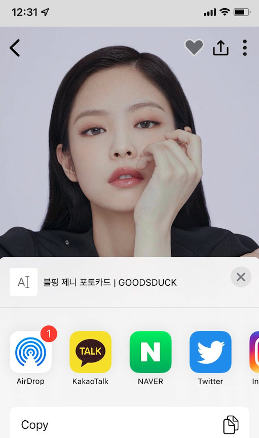
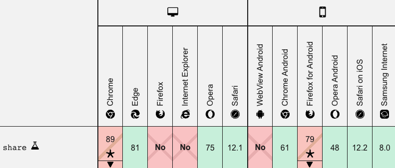
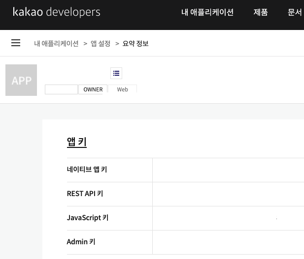
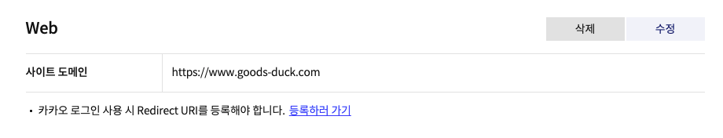
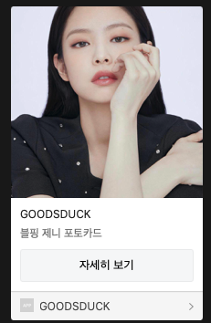

현재 만들고 있는 서비스에 공유 기능이 필요해서 구현하게 되었다. 어려웠던 기능은 아니었는데, 웹앱이라는 특이한 상황에서는 약간의 삽질이 있어서 정리하고자 한다!

- 현재 RN의 webview를 통해 **웹앱**을 만들고 있다.
- RN이 아닌 리액트 코드로 공유 기능을 구현하려고 한다.
- Web Share API를 이용하지 않고 구현한 SNS 공유는 카카오톡, 트위터, 페이스북 이다.

Web Share API를 사용할 수 있는 브라우저(ex. iOS)에서는 Web Share API를 이용해 공유 기능을 구현하고, Web Share API를 사용할 수 없는 브라우저(ex. 안드로이드 웹뷰, 크롬 등)를 확인해 해당 브라우저에서는 필요한 SNS만 JS를 이용해 공유 기능을 직접 구현했다.

# Web Share API를 이용해 web에서 SNS 공유하기

## Web Share API 사용법

```jsx
window.navigator.share({
  title: '', // 공유될 제목
  text: '', // 공유될 설명
  url: '', // 공유될 URL
  files: [], // 공유할 파일 배열
});
```

Web Share API를 사용하는 방법은 매우 간단하다. 

- 공유될 제목, 설명, url, 파일들을 넣어서 공유할 수 있다.
- files는 옵션이기 때문에 title, text, url만 제대로 넣어주면 된다
- url에는 공유하고자 하는 주소를 넣어주면 되고, 현재 주소를 공유하고 싶다면 `window.location.href` 를 넣어주면 지금 내가 보고 있는 주소를 공유할 수 있다.

### 모바일 웹 환경 👍

사실 모바일 웹 환경에서는 Web Share API를 이용하면 아주 간단하고 쉽게 공유 기능을 만들 수 있다. 예를 들어서, 아이폰에서 Web Share API를 이용해서 공유하는 경우에는 일반적으로 공유하기 기능을 이용할 때 자주 보던 화면인 아래와 같은 공유 화면을 유저에게 보여줄 수 있다. 



### 일반적인 웹 환경 👎

하지만 Web Share API는 [MDN](https://developer.mozilla.org/ko/docs/Web/API/Navigator/share)에 의하면 제공되는 환경이 많지 않다. 특히 크롬에서 지원이 안되기 때문에 사실상 일반적인 웹 환경에서의 지원은 불가능하다고 봐야되는 수준이다. 하지만 모바일의 경우에는 Firefox를 제외하고는 지원되는 것을 알 수 있다. (여기서보면 안드로이드 웹뷰에서는 지원되지 않는데, 이 점 때문에 웹앱을 만들고 있는 나의 상황에서는 이 사실을 처음에 제대로 확인하지 않아서 헤맸었다 ㅜㅜ)




### ⚠️ Web Share API 지원 환경인지 확인하기

위처럼 Web Share API는 지원되지 않는 환경이 있기 때문에 현재 나의 브라우저가 지원 환경인지를 먼저 확인한 후에 API를 실행하는 것이 안전하다. 이를 확인하기 위해서는 `navigator.share`의 type이 undefined인지를 확인하면된다. 그래서 undefined이 아니라면 Web Share API를 실행하면 된다.

```jsx
**if (typeof navigator.share !== "undefined") {**
	window.navigator.share({
	  title: '', // 공유될 제목
	  text: '', // 공유될 설명
	  url: '', // 공유될 URL
	  files: [], // 공유할 파일 배열
	});
**}**
```

# 다른 방법으로 SNS 공유하기 (카카오톡, 트위터, 페이스북)

Web Share API는 아주 쉽게 공유할 수 있지만, 지원되지 않는 환경이 많았다. 특히 웹앱을 제작하고 있는 내 상황에서 안드로이드에서는 공유가 안된다는 점은 매우 치명적이었다..ㅜㅜ 따라서 iOS에서는 Web Share API를 이용해 공유를 하고, 안드로이드에서는 다른 방법을 이용해 공유 기능을 제공하기로 했다.

## 카카오

카카오톡은 다른 SNS에 비해 공유 기능을 만드는 것이 까다로운 편으로 알고 있다. 사전 작업이 필요하기 때문인데, 사실 내 경우에는 카카오톡 소셜 로그인을 만든 적이 있어서 쉽게 구현할 수 있었다.

> 카카오톡 공유를 위한 사전 작업하기
> 
1. [Kakao Developers](https://developers.kakao.com/)에 접속해서 가입하고, 내 어플리케이션에서 어플리케이션을 추가해야한다.
2. 어플리케이션을 추가하면 앱 키를 알 수 있는데, 그 중 JavaScript 키를 사용할 예정이다.
    
    

    
3. 마지막으로 플랫폼에서 Web 사이트 도메인 등록까지 해주면 사전 작업은 끝이 난다.
    
    

    

> 카카오에서 제공하는 공유 기능을 사용하기 때문에 카카오에서 제공하는 js 파일을 추가해줘야 한다.
> 

```jsx
<script src="//developers.kakao.com/sdk/js/kakao.min.js"></script>
```

> 카카오에서 제공하는 `Kakao.Link`를 통해 카카오톡을 통해 공유할 수 있는 버튼을 만들면 된다.
> 

아래 코드는 내가 공유할 때 필요한 내용만 적은 것이므로, 원하는 공유 내용으로 커스텀이 필요하다면 [Kakao developers의 문서](https://developers.kakao.com/docs/latest/ko/message/js-link)에서 참고!

```jsx
Kakao.Link.sendDefault({
	objectType: "feed",
	content: {
		title: '', // 공유될 제목
		description: '', // 공유될 설명
		imageUrl: '', // 공유될 이미지 url
		link: {
			mobileWebUrl: '',// 공유될 모바일 URL
			webUrl: '',// 공유될 웹 URL
		},
	},
});
```

> 카카오톡을 통해 공유된 결과물
> 




## 트위터, 페이스북

트위터, 페이스북의 경우 쉽게 구현할 수 있다.

### 트위터

```jsx
const sendText = ""; // 공유할 텍스트
const sendUrl = ""; // 공유할 URL
window.open(
`https://twitter.com/intent/tweet?text=${sendText}&url=${sendUrl}`,
);
```

### 페이스북

```jsx
const sendText = ""; // 공유할 텍스트
const sendUrl = ""; // 공유할 URL
window.open(
`http://www.facebook.com/sharer/sharer.php?u=${sendText}&url=${sendUrl}`,
);
```

</br>

# Ref.

- [Web Share API로 공유 기능 쉽게 구현하기 - 재그지그의 개발 블로그](https://wormwlrm.github.io/2020/05/09/Web-Share-API.html)

- [[JavaScript] 웹으로 SNS 공유하기(트위터, 페이스북, 카카오톡)](https://devpad.tistory.com/53)

- [Kakao Developers](https://developers.kakao.com/docs/latest/ko/message/js-link)