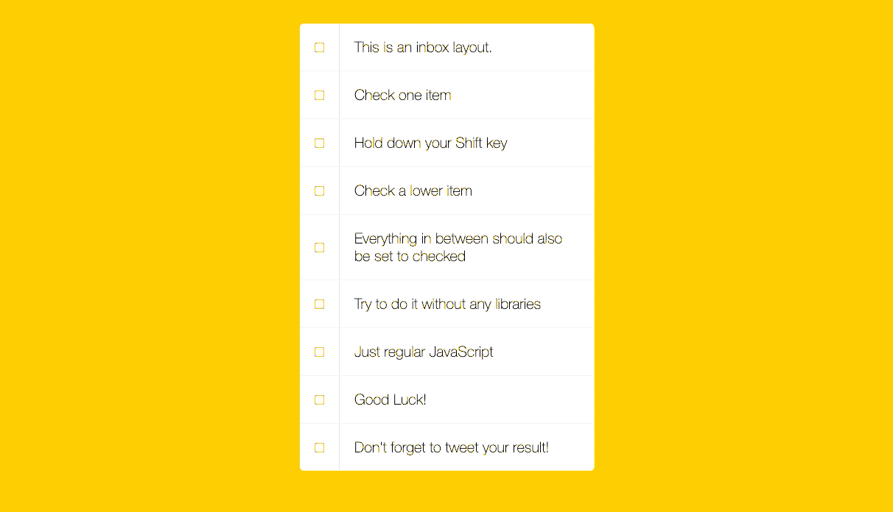
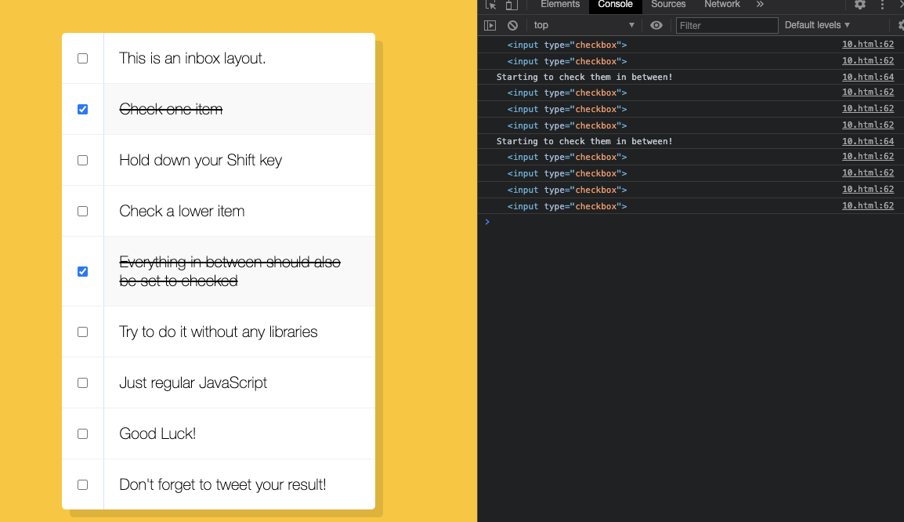

[Hold Shift and Check Checkboxes](https://2dowon.github.io/JavaScript30/html/10.html) 프로젝트의 핵심은 다음과 같다.

1. 모든 체크 박스에 click 이벤트리스너 추가
2. 마지막으로 체크한 체크박스와 Shift 키를 누른채 선택한 체크박스 확인
3. 마지막으로 체크한 체크박스와 Shift 키를 누른채 선택한 체크박스 사이의 체크박스들을 체크해주기

## 모든 체크 박스에 click 이벤트리스너 추가

- inbox 안에 있는 checkbox 타입의 input을 모두 가져와서 forEach로 각각의 체크박스마다 클릭 이벤트리스너 추가한다.
- 체크박스를 클릭하면 해당 체크박스는 lastChecked가 된다. 마지막으로 선택된 체크박스라는 뜻이다.

```jsx
const checkboxes = document.querySelectorAll('.inbox input[type="checkbox"]');
let lastChecked;

function handleCheck(e) {
  lastChecked = this;
  console.log(lastChecked);
}

checkboxes.forEach((checkbox) =>
  checkbox.addEventListener("click", handleCheck)
);
```

## 마지막으로 체크한 체크박스와 Shift 키를 누른채 선택한 체크박스 확인

- `e.shiftKey && this.checked` ⇒ Shift 키를 누르면서 체크박스를 눌렀는지 확인하기 위한 조건
- Shift 키를 누른채로 체크박스를 체크했다면 모든 체크박스들을 한번씩 돌면서 현재 `forEach`를 통해 확인하고 있는 체크박스가 Shift 키를 누른채 선택한 체크박스인지, 마지막으로 체크한 체크박스인지를 확인한다

```jsx
const checkboxes = document.querySelectorAll('.inbox input[type="checkbox"]');
let lastChecked;

function handleCheck(e) {
  if (e.shiftKey && this.checked) {
    checkboxes.forEach((checkbox) => {
      console.log(checkbox);
      if (checkbox === this || checkbox === lastChecked) {
        console.log("Starting to check them in between!");
      }
    });
  }
  lastChecked = this;
}

checkboxes.forEach((checkbox) =>
  checkbox.addEventListener("click", handleCheck)
);
```



## 마지막으로 체크한 체크박스와 Shift 키를 누른채 선택한 체크박스 사이의 체크박스들을 체크해주기

- 일단 기본적으로 클릭된 체크박스는 inBetween 값을 false로 갖고 있다.
- forEach로 체크박스들을 확인하면서 현재 체크박스가 Shift 키를 누른채 선택한 체크박스라면 그때 inBetween 값은 반대 값인 true를 가지도록 만들고, 현재 체크박스가 마지막으로 체크한 체크박스라면 inBetween 값은 다시 반대 값인 false를 갖도록 만든다. 결국 내가 마지막으로 체크한 체크박스와 Shift 키를 누른채 선택한 체크박스 사이의 체크박스들은 inBetween값이 true가 된다.
- 마지막으로 현재 체크박스의 inBetween값이 true라면 체크박스가 체크되도록 만들어주면 끝이다.

```jsx
const checkboxes = document.querySelectorAll('.inbox input[type="checkbox"]');
let lastChecked;

function handleCheck(e) {
  let inBetween = false;

  if (e.shiftKey && this.checked) {
    checkboxes.forEach((checkbox) => {
      console.log(checkbox);

      if (checkbox === this || checkbox === lastChecked) {
        inBetween = !inBetween;
        console.log("Starting to check them in between!");
      }

      if (inBetween) {
        checkbox.checked = true;
      }
    });
  }
  lastChecked = this;
}

checkboxes.forEach((checkbox) =>
  checkbox.addEventListener("click", handleCheck)
);
```

# 최종 코드

> index.html

```html
<!DOCTYPE html>
<html lang="en">
  <head>
    <meta charset="UTF-8" />
    <title>Hold Shift to Check Multiple Checkboxes</title>
    <link rel="stylesheet" href="../css/10.css" />
  </head>
  <body>
    <div class="inbox">
      <div class="item">
        <input type="checkbox" />
        <p>This is an inbox layout.</p>
      </div>
      <div class="item">
        <input type="checkbox" />
        <p>Check one item</p>
      </div>
      <div class="item">
        <input type="checkbox" />
        <p>Hold down your Shift key</p>
      </div>
      <div class="item">
        <input type="checkbox" />
        <p>Check a lower item</p>
      </div>
      <div class="item">
        <input type="checkbox" />
        <p>Everything in between should also be set to checked</p>
      </div>
      <div class="item">
        <input type="checkbox" />
        <p>Try to do it without any libraries</p>
      </div>
      <div class="item">
        <input type="checkbox" />
        <p>Just regular JavaScript</p>
      </div>
      <div class="item">
        <input type="checkbox" />
        <p>Good Luck!</p>
      </div>
      <div class="item">
        <input type="checkbox" />
        <p>Don't forget to tweet your result!</p>
      </div>
    </div>

    <script>
      const checkboxes = document.querySelectorAll(
        '.inbox input[type="checkbox"]'
      );
      let lastChecked;

      function handleCheck(e) {
        let inBetween = false;

        if (e.shiftKey && this.checked) {
          checkboxes.forEach((checkbox) => {
            console.log(checkbox);

            // shift 키를 누르고 체크한 체크박스(this)와 마지막 체크박스(lastChecked) 일때만 아래 조건 실행
            if (checkbox === this || checkbox === lastChecked) {
              inBetween = !inBetween;
              console.log("Starting to check them in between!");
            }

            // lastChecked와 this 사이에 있는 체크박스라면 shift 키를 누른채 선택된 영역이므로 inBetween 값이 true이므로 체크박스를 체크됨으로 설정
            if (inBetween) {
              checkbox.checked = true;
            }
          });
        }
        // 방금 체크한 체크박스가 마지막 체크박스가 된다
        lastChecked = this;
      }

      checkboxes.forEach((checkbox) =>
        checkbox.addEventListener("click", handleCheck)
      );
    </script>
  </body>
</html>
```

> style.css

```css
html {
  font-family: sans-serif;
  background: #ffc600;
}

.inbox {
  max-width: 400px;
  margin: 50px auto;
  background: white;
  border-radius: 5px;
  box-shadow: 10px 10px 0 rgba(0, 0, 0, 0.1);
}

.item {
  display: flex;
  align-items: center;
  border-bottom: 1px solid #f1f1f1;
}

.item:last-child {
  border-bottom: 0;
}

input:checked + p {
  background: #f9f9f9;
  text-decoration: line-through;
}

input[type="checkbox"] {
  margin: 20px;
}

p {
  margin: 0;
  padding: 20px;
  transition: background 0.2s;
  flex: 1;
  font-family: "helvetica neue";
  font-size: 20px;
  font-weight: 200;
  border-left: 1px solid #d1e2ff;
}
```

</br>

# Ref.

- [JS Checkbox Challenge! #JavaScript30 10/30](https://www.youtube.com/watch?v=RIPYsKx1iiU&list=PLu8EoSxDXHP6CGK4YVJhL_VWetA865GOH&index=10)

- [JAVASCRIPT 30](https://2dowon.github.io/JavaScript30/)

- [MDN - KeyboardEvent.shiftKey](https://developer.mozilla.org/en-US/docs/Web/API/KeyboardEvent/shiftKey)
