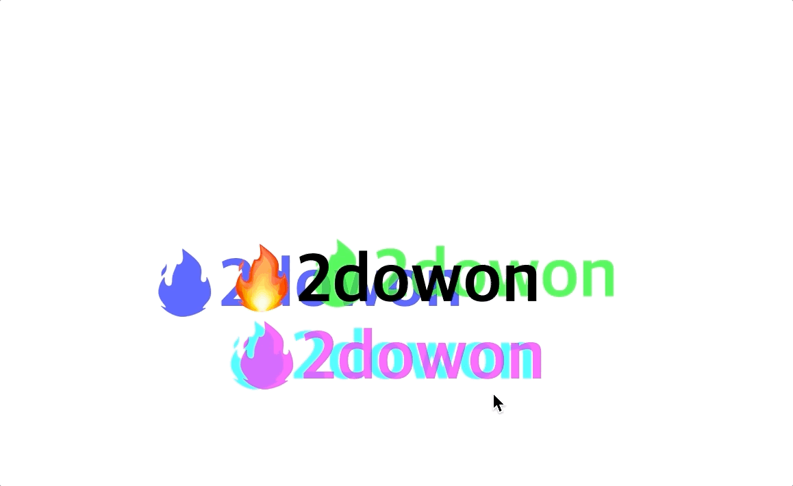

[Mouse Move Shadow](https://2dowon.github.io/JavaScript30/html/16.html) 프로젝트는 마우스의 움직임에 따라 여러 개의 그림자들이 같이 움직이는 것이다.

- 마우스의 위치 파악하기
- 마우스의 움직임에 따라 그림자가 움직이도록 하기

## 마우스의 위치 파악하기

- hero의 크기를 알기 위해 ⇒ `hero.offsetWidth` `hero.offsetHeight`
- 현재 마우스의 위치를 알기 위해 ⇒ `e.offsetX` `e.offsetY`
- `this` 는 hero를 가리키고, `e.target` 은 text 밖에 있으면 hero이고, text 안에 있으면 h1이다.
- 따라서 `e.target` 이 h1일 때는 offsetX와 offsetY 값이 hero일 때와 다르기 때문에 x는 `e.target.offsetLeft` 를, y는 `e.target.offsetTop` 를 더해줘야 한다.

```jsx
const hero = document.querySelector(".hero");
const text = hero.querySelector("h1");

function shadow(e) {
  // const { offsetWidth: width, offsetHeight: height } = hero;
  const width = hero.offsetWidth;
  const height = hero.offsetHeight;

  // let { offsetX: x, offsetY: y } = e;
  let x = e.offsetX;
  let y = e.offsetY;

  if (this !== e.target) {
    x = x + e.target.offsetLeft;
    y = y + e.target.offsetTop;
  }
}
hero.addEventListener("mousemove", shadow);
```

## 마우스의 움직임에 따라 그림자가 움직이도록 하기

- 처음에는 x, y값만 이용해서 마우스 움직임에 따라 그림자들의 위치를 설정했는데, 이 경우 브라우저의 왼쪽 위를 기준으로 그림자의 위치가 반영돼서 원하는 애니메이션을 만들 수 없었다.
- 따라서 마우스 움직임에 따라 hero를 주변을 맴돌면서 움직이도록 만들기 위해 xWalk와 yWalk값을 만든다

```jsx
const walk = 500;

function shadow(e) {
  const width = hero.offsetWidth;
  const height = hero.offsetHeight;

  let x = e.offsetX;
  let y = e.offsetY;

  if (this !== e.target) {
    x = x + e.target.offsetLeft;
    y = y + e.target.offsetTop;
  }

  const xWalk = Math.round((x / width) * walk - walk / 2);
  const yWalk = Math.round((y / height) * walk - walk / 2);

  text.style.textShadow = `
    ${xWalk}px ${yWalk}px 0 rgba(255,0,255,0.7),
    ${xWalk * -1}px ${yWalk}px 0 rgba(0,255,255,0.7),
    ${yWalk}px ${xWalk * -1}px 0 rgba(0,255,0,0.7),
    ${yWalk * -1}px ${xWalk}px 0 rgba(0,0,255,0.7)
  `;
}
```

# 최종 코드

> index.html

✅ `contenteditable` 속성을 이용하면 유저가 직접 text를 수정할 수 있다.

```html
<!DOCTYPE html>
<html lang="en">
  <head>
    <meta charset="UTF-8" />
    <title>Mouse Shadow</title>
  </head>
  <body>
    <div class="hero">
      <h1 contenteditable>🔥WOAH!</h1>
    </div>

    <style>
      html {
        color: black;
        font-family: sans-serif;
      }

      body {
        margin: 0;
      }

      .hero {
        min-height: 100vh;
        display: flex;
        justify-content: center;
        align-items: center;
        color: black;
      }

      h1 {
        text-shadow: 10px 10px 0 rgba(0, 0, 0, 1);
        font-size: 100px;
      }
    </style>

    <script src="../js/16.js"></script>
  </body>
</html>
```

> JS

```jsx
const hero = document.querySelector(".hero");
const text = hero.querySelector("h1");
const walk = 500;

function shadow(e) {
  const width = hero.offsetWidth;
  const height = hero.offsetHeight;

  let x = e.offsetX;
  let y = e.offsetY;

  if (this !== e.target) {
    x = x + e.target.offsetLeft;
    y = y + e.target.offsetTop;
  }

  const xWalk = Math.round((x / width) * walk - walk / 2);
  const yWalk = Math.round((y / height) * walk - walk / 2);

  text.style.textShadow = `
      ${xWalk}px ${yWalk}px 0 rgba(255,0,255,0.7),
      ${xWalk * -1}px ${yWalk}px 0 rgba(0,255,255,0.7),
      ${yWalk}px ${xWalk * -1}px 0 rgba(0,255,0,0.7),
      ${yWalk * -1}px ${xWalk}px 0 rgba(0,0,255,0.7)
    `;
}
hero.addEventListener("mousemove", shadow);
```

<br>

# Ref.

- [CSS Text Shadow on Mouse Move Effect - #JavaScript30 16/30](https://www.youtube.com/watch?v=zaz9gLI-Xac&list=PLu8EoSxDXHP6CGK4YVJhL_VWetA865GOH&index=16)

- [JAVASCRIPT 30](https://2dowon.github.io/JavaScript30/)

- [HTMLElement.offsetWidth](https://developer.mozilla.org/en-US/docs/Web/API/HTMLElement/offsetWidth)
