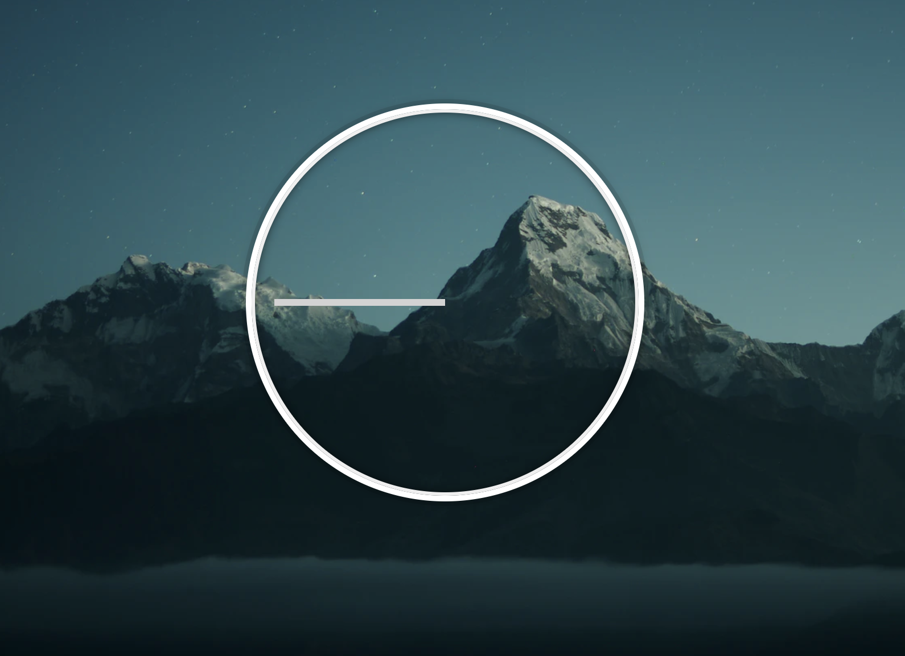
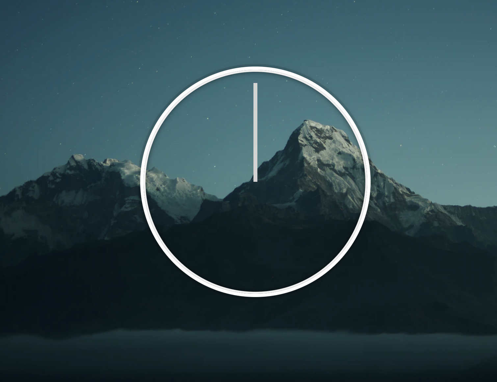

JS and CSS Clock 프로젝트의 핵심은 다음과 같다.

1. 시계 세팅하기
2. 현재 시각 가져오기
3. 가져온 시각을 바탕으로 시침, 분침, 초침 움직이기

## 시계 세팅하기

아날로그 시계를 작업하는 다양한 방법이 존재하지만, Wes Bos 강의에서는 아날로그 시계를 만들기 전에 기본적인 시계 상태를 제공해주고, 이에 css를 간단하게 작업해서 나중에 시계가 작동하기 쉽게 만들어주었다.

```css
.hand {
  transform-origin: 100%;
  transform: rotate(90deg);
  transition: all 0.05s;
  transition-timing-function: cubic-bezier(0.1, 2.7, 0.58, 1);
}
```

- [`transform-origin`](https://developer.mozilla.org/en-US/docs/Web/CSS/transform-origin) 회전 중심을 지정할 때 사용 (0% left/top, 50% center, 100% rignt/bottom)

  50%가 center이기 때문에 보통은 50%를 주로 사용하지만, 우리는 시계바늘의 오른쪽 부분이 중심이 되기를 원하기 때문에 100%로 설정했다.

- 시간이 12시 정각부터 시작할 수 있도록 90deg를 회전시켰다
- 시계바늘이 움직일 때마다 진짜 시계가 움직이는 것처럼 보이기 위해 [`transition-timing-function : cubic-bezier()`](https://developer.mozilla.org/en-US/docs/Web/CSS/transition-timing-function) 를 이용했다.

> 처음에 제공되는 시계 상태 (디자인 등 약간의 css는 수정했다)



> 시계를 작동시키기 전 세팅하고자 하는 시계 상태



## 현재 시각 가져오기

[Date](https://developer.mozilla.org/ko/docs/Web/JavaScript/Reference/Global_Objects/Date) 객체를 새로 만들면 이 객체를 통해 날짜, 시간 등과 관련된 값을 얻을 수 있다.

### ✍️ My Code & 👍 Wes Bos Code

- 현재 시각을 구하는 법은 Date 객체를 생성해서 구하는 것으로 내 코드와 Wes Bos의 코드가 거의 동일하다.
- 시각은 1초마다 업데이트되기 때문에 setInterval 함수를 통해서 시각을 구하는 getTime 함수를 1초마다 실행시켜주었다.

```jsx
function setDate() {
  const now = new Date();
  const seconds = now.getSeconds();
  const mins = now.getMinutes();
  const hour = now.getHours();
}

setInterval(setDate, 1000);

setDate();
```

## 가져온 시각을 바탕으로 시침, 분침, 초침 움직이기

처음에는 삼각함수를 통해 x, y 값을 구해서 만들어야 되나 고민했는데, 시계는 움직이는 각도가 정해져 있기 때문에 단순하게 각도를 계산해서 회전시키면 만들 수 있다.

### ✍️ My Code

- 시각의 경우 24시까지 있지만, 시계의 경우 12시까지만 표시되기 떄문에 12보다 크거나 같다면 12를 빼줌으로써 시각이 0 ~ 11 사이로 유지되도록 만들었다.
- 시침은 12개, 분침과 초침은 60개로 간격이 나누어져 있다. 따라서 원은 360도 이므로 시침은 30도씩, 분침과 초침은 6도씩 움직이도록 tranform에서 roate를 설정해줬다.
- 12시 정각부터 시작하기 위해서는 90을 더해줘야 한다.
- 🤔 하지만 이 경우 한 번에 움직이기 때문에 분이 지남에 따라 시침도 어느정도 같이 움직여줘야 하는데, 그 점이 되지 않았다. (밑에서 해결!)

```jsx
const hourHand = document.querySelector(".hour-hand");
const minHand = document.querySelector(".min-hand");
const secondHand = document.querySelector(".second-hand");

function getTime() {
  const date = new Date();
  const hours = date.getHours();
  const hour = hours >= 12 ? hours - 12 : hours;
  const minute = date.getMinutes();
  const second = date.getSeconds();

  hourHand.style.transform = `rotate(${90 + 30 * hour}deg)`;
  minHand.style.transform = `rotate(${90 + 6 * minute}deg)`;
  secondHand.style.transform = `rotate(${90 + 6 * second}deg)`;
}

function init() {
  getTime();
  setInterval(getTime, 1000);
}

init();
```

### 👍 Wes Bos Code

- 시침은 12개, 분침과 초침은 60개로 간격이 나누어져 있으므로 구한 시, 분, 초에 각각 간격을 나누어주고 360을 곱하면 360 중에 얼마나 시, 분, 초가 지났는지 계산할 수 있다.
- ✅ 분침 각도에는 초침 각도를 더해주고, 시침 각도에는 분침 각도를 더해주게 되면 결국 시간이 지남에 따라 시침이 계속 조금씩 움직이게 된다.

```jsx
const secondHand = document.querySelector(".second-hand");
const minsHand = document.querySelector(".min-hand");
const hourHand = document.querySelector(".hour-hand");

function setDate() {
  const now = new Date();

  const seconds = now.getSeconds();
  const secondsDegrees = (seconds / 60) * 360 + 90;
  secondHand.style.transform = `rotate(${secondsDegrees}deg)`;

  const mins = now.getMinutes();
  const minsDegrees = (mins / 60) * 360 + (seconds / 60) * 6 + 90;
  minsHand.style.transform = `rotate(${minsDegrees}deg)`;

  const hour = now.getHours();
  const hourDegrees = (hour / 12) * 360 + (mins / 60) * 30 + 90;
  hourHand.style.transform = `rotate(${hourDegrees}deg)`;
}

setInterval(setDate, 1000);

setDate();
```

# 최종 코드

> index.html

```html
<!DOCTYPE html>
<html lang="en">
  <head>
    <meta charset="UTF-8" />
    <title>JS + CSS Clock</title>
    <link rel="stylesheet" href="style.css" />
  </head>

  <body>
    <div class="clock">
      <div class="clock-face">
        <div class="hand hour-hand"></div>
        <div class="hand min-hand"></div>
        <div class="hand second-hand"></div>
      </div>
    </div>
    <script src="app.js"></script>
  </body>
</html>
```

> style.css

```css
html {
  background-image: url(https://images.unsplash.com/photo-1485470733090-0aae1788d5af?ixid=MXwxMjA3fDB8MHxwaG90by1wYWdlfHx8fGVufDB8fHw%3D&ixlib=rb-1.2.1&auto=format&fit=crop&w=1691&q=80);
  background-size: cover;
  background-position: center;
  font-family: "helvetica neue";
  text-align: center;
  font-size: 10px;
}

body {
  margin: 0;
  font-size: 2rem;
  display: flex;
  flex: 1;
  min-height: 100vh;
  align-items: center;
}

.clock {
  width: 30rem;
  height: 30rem;
  border: 5px solid white;
  border-radius: 50%;
  margin: 50px auto;
  position: relative;
  padding: 2rem;
  box-shadow: 0 0 0 4px rgba(0, 0, 0, 0.1), inset 0 0 0 3px #efefef,
    inset 0 0 10px black, 0 0 10px rgba(0, 0, 0, 0.2);
}

.clock-face {
  position: relative;
  width: 100%;
  height: 100%;
  transform: translateY(-3px);
  /* account for the height of the clock hands */
}

.hand {
  width: 50%;
  height: 6px;
  background: lightgrey;
  position: absolute;
  top: 50%;
  transform-origin: 100%;
  transform: rotate(90deg);
  transition: all 0.05s;
  transition-timing-function: cubic-bezier(0.1, 2.7, 0.58, 1);
}
.hour-hand {
  width: 30%;
  left: 20%;
  transform-origin: 100%;
}
.second-hand {
  height: 3px;
}
```

> app.js

```jsx
const secondHand = document.querySelector(".second-hand");
const minHand = document.querySelector(".min-hand");
const hourHand = document.querySelector(".hour-hand");

function setDate() {
  const date = new Date();

  const seconds = date.getSeconds();
  const secondsDegrees = (seconds / 60) * 360 + 90;
  secondHand.style.transform = `rotate(${secondsDegrees}deg)`;

  const mins = date.getMinutes();
  const minsDegrees = (mins / 60) * 360 + (seconds / 60) * 6 + 90;
  minHand.style.transform = `rotate(${minsDegrees}deg)`;

  const hour = date.getHours();
  const hourDegrees = (hour / 12) * 360 + (mins / 60) * 30 + 90;
  hourHand.style.transform = `rotate(${hourDegrees}deg)`;
}

setInterval(setDate, 1000);

setDate();
```

</br>

# Ref.

- [We build a CSS + JS Clock in Vanilla JS - #JavaScript30 2/30](https://www.youtube.com/watch?v=xu87YWbr4X0&list=PLu8EoSxDXHP6CGK4YVJhL_VWetA865GOH&index=2)

- [2dowon/JavaScript30](https://github.com/2dowon/JavaScript30/tree/main/01%20-%20JavaScript%20Drum%20Kit)
