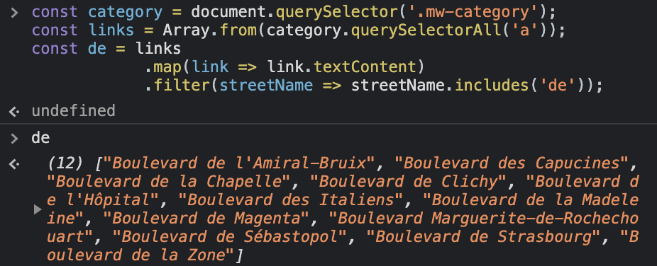

# 4 - Array Cardio Day 1

Array Cardio Day 1 프로젝트는 **Array의 다양한 메서드 연습하기!** 이다. 오늘 연습할 Array의 메서드는 다음과 같다.

- [filter](https://developer.mozilla.org/ko/docs/Web/JavaScript/Reference/Global_Objects/Array/filter)
- [map](https://developer.mozilla.org/ko/docs/Web/JavaScript/Reference/Global_Objects/Array/map)
- [sort](https://developer.mozilla.org/ko/docs/Web/JavaScript/Reference/Global_Objects/Array/sort)
- [reduce](https://developer.mozilla.org/ko/docs/Web/JavaScript/Reference/Global_Objects/Array/Reduce)

> 사용할 데이터

```jsx
const inventors = [
  { first: "Albert", last: "Einstein", year: 1879, passed: 1955 },
  { first: "Isaac", last: "Newton", year: 1643, passed: 1727 },
  { first: "Galileo", last: "Galilei", year: 1564, passed: 1642 },
  { first: "Marie", last: "Curie", year: 1867, passed: 1934 },
  { first: "Johannes", last: "Kepler", year: 1571, passed: 1630 },
  { first: "Nicolaus", last: "Copernicus", year: 1473, passed: 1543 },
  { first: "Max", last: "Planck", year: 1858, passed: 1947 },
  { first: "Katherine", last: "Blodgett", year: 1898, passed: 1979 },
  { first: "Ada", last: "Lovelace", year: 1815, passed: 1852 },
  { first: "Sarah E.", last: "Goode", year: 1855, passed: 1905 },
  { first: "Lise", last: "Meitner", year: 1878, passed: 1968 },
  { first: "Hanna", last: "Hammarström", year: 1829, passed: 1909 },
];

const people = [
  "Bernhard, Sandra",
  "Bethea, Erin",
  "Becker, Carl",
  "Bentsen, Lloyd",
  "Beckett, Samuel",
  "Blake, William",
  "Berger, Ric",
  "Beddoes, Mick",
  "Beethoven, Ludwig",
  "Belloc, Hilaire",
  "Begin, Menachem",
  "Bellow, Saul",
  "Benchley, Robert",
  "Blair, Robert",
  "Benenson, Peter",
  "Benjamin, Walter",
  "Berlin, Irving",
  "Benn, Tony",
  "Benson, Leana",
  "Bent, Silas",
  "Berle, Milton",
  "Berry, Halle",
  "Biko, Steve",
  "Beck, Glenn",
  "Bergman, Ingmar",
  "Black, Elk",
  "Berio, Luciano",
  "Berne, Eric",
  "Berra, Yogi",
  "Berry, Wendell",
  "Bevan, Aneurin",
  "Ben-Gurion, David",
  "Bevel, Ken",
  "Biden, Joseph",
  "Bennington, Chester",
  "Bierce, Ambrose",
  "Billings, Josh",
  "Birrell, Augustine",
  "Blair, Tony",
  "Beecher, Henry",
  "Biondo, Frank",
];
```

## `filter()`

- 필터를 이용하면 우리가 원하는 값만 받아서 새로운 배열로 반환할 수 있다
- filter의 기본 문법

  ```jsx
  arr.filter(callback(element[, index[, array]])[, thisArg])
  ```

### Filter the list of inventors for those who were born in the 1500's

```jsx
const fifteen = inventors.filter(
  (inventor) => inventor.year >= 1500 && inventor.year < 1600
);
console.table(fifteen);
```

## `map()`

- 배열 안의 각각의 요소들이 callback함수를 거쳐서 다시 새로운 값으로 변환하는 것
- 배열 안에 있는 요소들을 함수를 통해 다른 방식으로 가져오고 싶을 때 사용
- map 함수의 기본 문법

  ```jsx
  arr.map(callback(currentValue[, index[, array]])[, thisArg])
  ```

  - callback함수에 따라 각각의 요소들이 다른 값으로 mapping 된다
  - callback 함수의 이름은 최대한 한번에 이해하기 쉽게 쓰는 것이 좋다

### Give us an array of the inventors first and last names

```jsx
const fullNames = inventors.map(
  (inventor) => `${inventor.first} ${inventor.last}`
);
console.log(fullNames);
```

### create a list of [Boulevards in Paris](https://en.wikipedia.org/wiki/Category:Boulevards_in_Paris) that contain 'de' anywhere in the name

- 이 경우 해당 페이지의 콘솔 창에서 실행해야 한다
- 처음에는 당황했는데, 실제 페이지에서 HTML 구조를 보고 원하는 요소를 찾아서 하는 연습이 필요하다고 생각해서 넣은 예제같다.

```jsx
const category = document.querySelector(".mw-category");
const links = Array.from(category.querySelectorAll("a"));
const de = links
  .map((link) => link.textContent)
  .filter((streetName) => streetName.includes("de"));
```



## `sort()`

- 배열을 일정 순서에 따라 정렬할 때 사용
- `sort` 함수의 기본 문법

  ```jsx
  arr.sort([compareFunction]);
  ```

  - compareFunction이 생략되면 배열의 element들은 문자열로 취급되어 유니코드 값 순서대로 정렬
  - a, b 두 개의 element를 파라미터로 입력받을 때, 함수에서 리턴되는 값이 0보다 작으면 a가 b보다 앞에 오도록 정렬하고, 리턴 값이 0보다 클 경우 b가 a보다 앞에 오도록 정렬한다.

- 오름차순 (낮은 숫자부터) : `sort((a, b) => a - b)`
- 내림차순 (높은 숫자부터) : `sort((a, b) => b - a)`

### Sort the inventors by birthdate, oldest to youngest (오름차순)

```jsx
const ordered = inventors.sort((a, b) => a.year - b.year);
console.table(ordered);
```

### Sort the inventors by years lived

- 오래사신 분들을 기준으로 정렬하기 위해 passed - year 계산을 통해서 몇 세까지 사셨는지 구한 후, 그 다음 값과 비교하면서 정렬해주면 된다
- a = lastInventor, b = nextInventor이므로 내림차순으로 정렬하기 위해 b - a 를 하면 된다.

```jsx
const oldest = inventors.sort(function (a, b) {
  const lastInventor = a.passed - a.year;
  const nextInventor = b.passed - b.year;
  return nextInventor - lastInventor;
});
console.table(oldest);
```

### Sort the inventors by years lived

> ✍️ My Code

- sort 함수의 compareFunction이 생략되면 배열의 element들은 문자열로 취급되어 유니코드 값 순서대로 정렬된다.
- 따라서 알파벳 순으로 정렬하기 위해서는 정렬하고자 하는 배열에 sort 함수만 적용해도 된다.

```jsx
const answer7 = people.sort();
console.log(answer7);
```

> 👍 Wes Bos Code

- 하지만 위 방법으로는 last name을 기준으로 오름차순 정렬만 가능하다. 아래 방법을 이용하면 내림차순 정렬도 가능하고, first name을 기준으로도 정렬할 수 있다.
- 알파벳의 아스키코드 값은 A(65)가 Z(90)보다 작기 때문에 알파벳 순으로 정렬하는 것은 오름차순으로 정렬하는 것과 같다.

```jsx
const alpha = people.sort((lastOne, nextOne) => {
  const [aLast, aFirst] = lastOne.split(", ");
  const [bLast, bFirst] = nextOne.split(", ");
  return aLast - bLast;
});
console.log(alpha);
```

## `reduce()`

- 우리가 원하는 시작점부터 모든 배열을 돌면서 어떤 값을 누적할 때 사용
- reduce 함수의 기본 문법

  ```jsx
  arr.reduce((prev, curr)
  ```

  - prev : 리턴된 값이 그 다음으로 호출될 때 prev로 연결된다 (리턴하는 값들이 prev로 순차적으로 전달된다)
  - curr : 배열 하나하나씩 순차적으로 curr에 전달이 된다

### How many years did all the inventors live all together?

> reduce를 사용하지 않는다면

```jsx
let totalYears = 0;
for (let i = 0; i < inventors.length; i++) {
  totalYears += inventors[i].passed - inventors[i].year;
}
console.log(totalYears);
```

> ✍️ My Code

- 먼저 map을 이용해 모든 요소마다 passed - year 계산으로 살아온 세월을 구했다.
- 그 다음 reduce를 이용해 그 전 값과 현재 값을 더해 총 합을 구했다. 이때 초깃값은 0으로 설정했다.

```jsx
const totalYears = inventors
  .map((inventor) => inventor.passed - inventor.year)
  .reduce((prev, curr) => {
    return prev + curr;
  }, 0);
console.log(totalYears);
```

> 👍 Wes Bos Code

- 굳이 map으로 먼저 계산하지 않더라도 현재 값을 더할 때 계산해서 더하면 된다.
- total 값이 prev이고, inventor가 curr 이다.

```jsx
const totalYears = inventors.reduce((total, inventor) => {
  return total + (inventor.passed - inventor.year);
}, 0);

console.log(totalYears);
```

### Sum up the instances of each of these

- `{}` 를 초깃값으로 주면서 prev 값으로 obj를 전달한다.
- 처음에 `obj[item]` 으로 찾게 되면 당연히 빈 오브젝트이므로 undefined이다. 따라서 이 경우에는 `!obj[item]` 을 조건으로 만들어 undefined인 경우에는 true가 되어 item을 key로 하고, 0을 value로 하는 값을 만들어준다. 그 후 item의 key 값에 1을 더해주면 된다.
- 이렇게 작성하면 나중에 새로운 key가 생길지라도 에러 없이 바로 반영할 수 있다.
- 마지막으로 obj를 리턴해주면 된다.

```jsx
const data = [
  "car",
  "car",
  "truck",
  "truck",
  "bike",
  "walk",
  "car",
  "van",
  "bike",
  "walk",
  "car",
  "van",
  "car",
  "truck",
];

const transportation = data.reduce(function (obj, item) {
  if (!obj[item]) {
    obj[item] = 0;
  }
  obj[item]++;
  return obj;
}, {});

console.log(transportation);
// {car: 5, truck: 3, bike: 2, walk: 2, van: 2}
```

<br>

# Ref.

- [JavaScript Array Cardio Practice - Day 1 - #JavaScript30 4/30](https://www.youtube.com/watch?v=HB1ZC7czKRs)

- [JAVASCRIPT 30](https://2dowon.github.io/JavaScript30/)

- [[Javascript] 배열 정렬하기 (오름차순, 내림차순, 문자열, 객체)](https://hianna.tistory.com/409)

- [자바스크립트 Array map](https://yuddomack.tistory.com/entry/%EC%9E%90%EB%B0%94%EC%8A%A4%ED%81%AC%EB%A6%BD%ED%8A%B8-Array-map)
