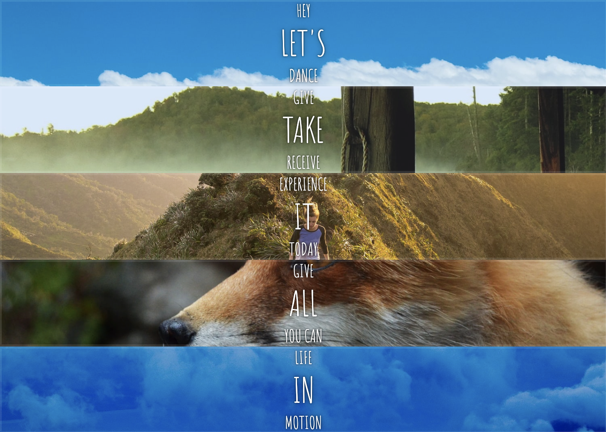

[Flex Panel Gallery 프로젝트](https://2dowon.github.io/JavaScript30/html/05.html)의 핵심은 다음과 같다.

- 원하는 모습으로 CSS 세팅 ⇒ `flex` 이용
- JS를 이용해 클릭할 때마다 패널이 커지면서 위 아래 글씨들이 나타나도록 하기

> 처음에 제공되는 모습



> 완성 모습
> 

## CSS 세팅

### flex

- CSS 속성 중 하나인 flex는 하나의 flex item이 자신의 컨테이너가 차지하는 공간에 맞추기 위해 크기를 키우거나 줄이는 방법을 설정하는 속성이다
- flex는 flex-grow, flex-shrink, flex-basis의 단축 속성이다.
- flex의 값에는 auto, initial, none이나 단위 없는 양의 수를 사용해야 한다.
- flex 속성은 한 개에서 세 개의 값을 사용해 지정할 수 있다.
  - **값이 한 개일 때**, 그 값은 다음 중 하나여야 한다.
    - [`<number>`](https://developer.mozilla.org/ko/docs/Web/CSS/number)를 지정하면 `<flex-grow>`입니다.
    - [`<length>`](https://developer.mozilla.org/ko/docs/Web/CSS/length) 또는 [`<percentage>`](https://developer.mozilla.org/ko/docs/Web/CSS/percentage)를 지정하면 `<flex-basis>`입니다.
    - `none`, `auto`, `initial` 중 하나를 지정할 수 있습니다.
  - **값이 두 개일때**, 첫 번째 값은 [`<number>`](https://developer.mozilla.org/ko/docs/Web/CSS/number)여야 하며 `<flex-grow>`가 된다. 두 번째 값은 다음 중 하나여야 한다.
    - [`<number>`](https://developer.mozilla.org/ko/docs/Web/CSS/number)를 지정하면 `<flex-shrink>`입니다.
    - [`<length>`](https://developer.mozilla.org/ko/docs/Web/CSS/length), [`<percentage>`](https://developer.mozilla.org/ko/docs/Web/CSS/percentage), 또는 `auto`를 지정하면 `<flex-basis>`입니다.
  - **값이 세 개일 때**는 다음 순서를 따라야 한다.
    1. `<flex-grow>`에 사용할 [`<number>`](https://developer.mozilla.org/ko/docs/Web/CSS/number)
    2. `<flex-shrink>`에 사용할 [`<number>`](https://developer.mozilla.org/ko/docs/Web/CSS/number)
    3. `<flex-basis>`에 사용할 [`<length>`](https://developer.mozilla.org/ko/docs/Web/CSS/length), [`<percentage>`](https://developer.mozilla.org/ko/docs/Web/CSS/percentage), 또는 `auto`

### 원하는 모습으로 CSS 세팅

- 먼저 panel들을 나란히 놓기 위해서 panels의 display를 flex로 한다
- 패널 안에 있는 p 태그들이 세로로 가운데 정렬되어 있도록 만든다

```css
.panels {
  min-height: 100vh;
  overflow: hidden;
  display: flex;
}

.panel {
  width: 20%;
  background: #6b0f9c;
  box-shadow: inset 0 0 0 5px rgba(255, 255, 255, 0.1);
  color: white;
  text-align: center;
  /* Safari transitionend event.propertyName === flex */
  /* Chrome + FF transitionend event.propertyName === flex-grow */
  transition: font-size 0.7s cubic-bezier(0.61, -0.19, 0.7, -0.11), flex 0.7s
      cubic-bezier(0.61, -0.19, 0.7, -0.11), background 0.2s;
  font-size: 20px;
  background-size: cover;
  background-position: center;
  display: flex;
  flex-direction: column;
  justify-content: center;
  flex: 1;
}
```

- 패널들의 p 태그들이 1/3 공간을 차지하도록 한다 ⇒ `flex: 1 0 auto;`
- 이 때 공간의 정중앙에 위치할 수 있도록 한다.

```css
.panel > * {
  margin: 0;
  width: 100%;
  transition: transform 0.5s;
  flex: 1 0 auto;
  display: flex;
  justify-content: center;
  align-items: center;
}
```


- p 태그 중 첫 번째와 마지막은 처음에는 보이지 않다가 클릭했을 경우에만 보이도록 한다. (클릭하면 open-actvie 클래스가 생길 수 있도록 JS에서 작업한다.)

```css
.panel > *:first-child {
  transform: translateY(-100%);
}
.panel.open-active > *:first-child {
  transform: translateY(0);
}
.panel > *:last-child {
  transform: translateY(100%);
}
.panel.open-active > *:last-child {
  transform: translateY(0);
}
```

- 패널을 클릭하면 open 클래스가 추가되고, flex를 5로 설정해 다른 패널의 길이보다 5배 크도록 만든다.

```css
.panel.open {
  font-size: 40px;
  flex: 5;
}
```

## JS를 이용해 클릭할 때마다 패널이 커지면서 위 아래 글씨들이 나타나도록 하기

### ✍️ My Code

- 내가 먼저 작성했을 때는 일단 위에서는 p태그에 적용하는 클래스 이름을 open-active가 아닌 그냥 open으로 설정했다.
- 패널을 클릭하면 open 클래스를 추가해주는데, 이미 open 클래스가 있다면 그 때는 제거해주는 방식으로 작성했다.
- 이벤트 위임을 위해서 패널을 감싸고 있는 panels에 이벤트를 주었다.
- 패널을 클릭하지 않고 p 태그를 클릭하는 경우에는 p 태그의 부모인 패널에 클래스를 주거나 제거할 수 있도록 했다.
- 🤔 p 태그가 위아래로 나타나는 애니메이션이 패널의 크기가 커지는 등 다른 애니메이션과 같이 동작해 조금 어색한 부분이 있다.

```jsx
const panels = document.querySelector(".panels");

panels.addEventListener("click", (e) => {
  if (e.target.tagName == "P") {
    if (e.target.parentNode.classList.contains("open")) {
      e.target.parentNode.classList.remove("open");
    } else {
      e.target.parentNode.classList.add("open");
    }
  } else {
    if (e.target.classList.contains("open")) {
      e.target.classList.remove("open");
    } else {
      e.target.classList.add("open");
    }
  }
});
```

### 👍 Wes Bos Code

- ✅ [`toggle`](https://developer.mozilla.org/en-US/docs/Web/API/DOMTokenList/toggle)을 이용하면 classList에 클래스가 없으면 추가하고, 있으면 제거하기 때문에 내가 한 방식처럼 있는지 체크해서 제거하거나 추가할 필요가 없다.

  > toggle을 이용한 코드에 이벤트 위임을 적용

  ```jsx
  const panels = document.querySelector(".panels");

  panels.addEventListener("click", (e) => {
    if (e.target.tagName == "P") {
      e.target.parentNode.classList.toggle("open");
    } else {
      e.target.classList.toggle("open");
    }
  });
  ```

- transitionend가 발생하면 toggleActive 함수를 실행함으로써 p 태그가 위 아래로 나타날 수 있도록 한다. 클릭했을 때의 transitionend는 open 클래스에 적용되어 있는 font-size와 flex이다. 따라서 e.propertyName을 콘솔에 찍으면 이렇게 2개가 나타나는데, 그 중 flex가 더 중요하기에 e.propertyName이 flex라면 open-active 클래스를 추가해주면 된다. 단, 브라우저에 따라 flex가 flex로 찍히기도 하고, flex-grow라고 찍히기도 하기 때문에 특정 이름으로 조건을 걸기 보다는 e.propertyName 안에 flex가 포함되어 있는지를 체크하면 더 확실하다.
- transitionend 변화가 끝난 후에 toggleActive 함수를 실행하기 때문에 이미 패널의 크기가 커진 후에 p 태그가 등장할 수 있어 더 자연스러운 애니메이션이 가능하다.

```jsx
const panels = document.querySelectorAll(".panel");

function toggleOpen() {
  this.classList.toggle("open");
}

function toggleActive(e) {
  // console.log(e.propertyName);
  if (e.propertyName.includes("flex")) {
    this.classList.toggle("open-active");
  }
}

panels.forEach((panel) => panel.addEventListener("click", toggleOpen));
panels.forEach((panel) =>
  panel.addEventListener("transitionend", toggleActive)
);
```

# 최종 코드

> index.html

```html
<!DOCTYPE html>
<html lang="en">
  <head>
    <meta charset="UTF-8" />
    <title>Flex Panels 💪</title>
    <link
      href="https://fonts.googleapis.com/css?family=Amatic+SC"
      rel="stylesheet"
      type="text/css"
    />
    <link rel="stylesheet" href="../css/05.css" />
  </head>
  <body>
    <div class="panels">
      <div class="panel panel1">
        <p>Hey</p>
        <p>Let's</p>
        <p>Dance</p>
      </div>
      <div class="panel panel2">
        <p>Give</p>
        <p>Take</p>
        <p>Receive</p>
      </div>
      <div class="panel panel3">
        <p>Experience</p>
        <p>It</p>
        <p>Today</p>
      </div>
      <div class="panel panel4">
        <p>Give</p>
        <p>All</p>
        <p>You can</p>
      </div>
      <div class="panel panel5">
        <p>Life</p>
        <p>In</p>
        <p>Motion</p>
      </div>
    </div>

    <script>
      const panels = document.querySelectorAll(".panel");

      function toggleOpen() {
        this.classList.toggle("open");
      }

      function toggleActive(e) {
        // console.log(e.propertyName);
        if (e.propertyName.includes("flex")) {
          this.classList.toggle("open-active");
        }
      }

      panels.forEach((panel) => panel.addEventListener("click", toggleOpen));
      panels.forEach((panel) =>
        panel.addEventListener("transitionend", toggleActive)
      );
    </script>
  </body>
</html>
```

> style.css

```css
html {
  box-sizing: border-box;
  background: #ffc600;
  font-family: "helvetica neue";
  font-size: 20px;
  font-weight: 200;
}

body {
  margin: 0;
}

*,
*:before,
*:after {
  box-sizing: inherit;
}

.panels {
  min-height: 100vh;
  overflow: hidden;
  display: flex;
}

.panel {
  width: 20%;
  background: #6b0f9c;
  box-shadow: inset 0 0 0 5px rgba(255, 255, 255, 0.1);
  color: white;
  text-align: center;
  /* Safari transitionend event.propertyName === flex */
  /* Chrome + FF transitionend event.propertyName === flex-grow */
  transition: font-size 0.7s cubic-bezier(0.61, -0.19, 0.7, -0.11), flex 0.7s
      cubic-bezier(0.61, -0.19, 0.7, -0.11), background 0.2s;
  font-size: 20px;
  background-size: cover;
  background-position: center;
  display: flex;
  flex-direction: column;
  justify-content: center;
  flex: 1;
}

.panel1 {
  background-image: url(https://source.unsplash.com/gYl-UtwNg_I/1500x1500);
}
.panel2 {
  background-image: url(https://source.unsplash.com/rFKUFzjPYiQ/1500x1500);
}
.panel3 {
  background-image: url(https://images.unsplash.com/photo-1465188162913-8fb5709d6d57?ixlib=rb-0.3.5&q=80&fm=jpg&crop=faces&cs=tinysrgb&w=1500&h=1500&fit=crop&s=967e8a713a4e395260793fc8c802901d);
}
.panel4 {
  background-image: url(https://source.unsplash.com/ITjiVXcwVng/1500x1500);
}
.panel5 {
  background-image: url(https://source.unsplash.com/3MNzGlQM7qs/1500x1500);
}

/* Flex Children */
.panel > * {
  margin: 0;
  width: 100%;
  transition: transform 0.5s;
  flex: 1 0 auto;
  display: flex;
  justify-content: center;
  align-items: center;
}

.panel > *:first-child {
  transform: translateY(-100%);
}
.panel.open-active > *:first-child {
  transform: translateY(0);
}
.panel > *:last-child {
  transform: translateY(100%);
}
.panel.open-active > *:last-child {
  transform: translateY(0);
}

.panel p {
  text-transform: uppercase;
  font-family: "Amatic SC", cursive;
  text-shadow: 0 0 4px rgba(0, 0, 0, 0.72), 0 0 14px rgba(0, 0, 0, 0.45);
  font-size: 2em;
}

.panel p:nth-child(2) {
  font-size: 4em;
}

.panel.open {
  font-size: 40px;
  flex: 5;
}
```

</br>

# Ref.

- [Flexbox + JavaScript Image Gallery - #JavaScript30 5/30](https://www.youtube.com/watch?v=9eif30i26jg&list=PLu8EoSxDXHP6CGK4YVJhL_VWetA865GOH&index=5)

- [JAVASCRIPT 30](https://2dowon.github.io/JavaScript30/)

- [flex](https://developer.mozilla.org/ko/docs/Web/CSS/flex)
