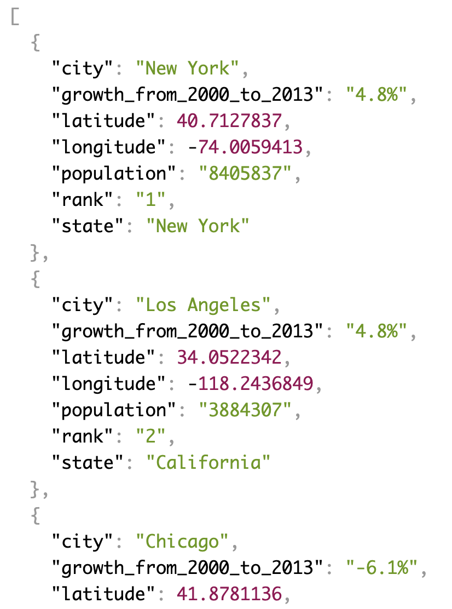

[Type Ahead](https://2dowon.github.io/JavaScript30/html/06.html) 프로젝트의 핵심은 다음과 같다.

1. fetch를 이용해 JSON 데이터 가져오기
2. 가져온 데이터 중에서 filter를 이용해 검색 값 찾기
3. 찾은 결과값을 HTML에 보여주기

## fetch를 이용해 JSON 데이터 가져오기

- 가져오려고 하는 [JSON 데이터](https://gist.githubusercontent.com/Miserlou/c5cd8364bf9b2420bb29/raw/2bf258763cdddd704f8ffd3ea9a3e81d25e2c6f6/cities.json)는 아래처럼 생겼다.

    

- JSON 데이터를 HTML로 동적으로 가져오기 위해서는 fetch를 이용하는 방법이 있다.
- fetch를 이용해 JSON 데이터를 가져오고, 가져온 데이터는 cities라는 배열에 spread 문법(`...`)을 이용해 하나씩 복사해서 넣어주었다.
- 만약 spread 문법을 이용하지 않고 그냥 넣는다면 배열 안의 배열인 중첩 구조가 된다.

```jsx
const endpoint =
  "https://gist.githubusercontent.com/Miserlou/c5cd8364bf9b2420bb29/raw/2bf258763cdddd704f8ffd3ea9a3e81d25e2c6f6/cities.json";

const cities = [];
fetch(endpoint)
  .then((response) => response.json())
  .then((data) => cities.push(...data));
```

## 가져온 데이터 중에서 filter를 이용해 검색 값 찾기

- cities 배열에서 filter를 사용해 아이템(place)마다 일치하는 것만 리턴하면 된다. city 또는 state와 매치되는지를 확인한다.
- 대문자, 소문자와 상관없이 결과값을 찾을 수 있도록 [RegExp](https://developer.mozilla.org/ko/docs/Web/JavaScript/Reference/Global_Objects/RegExp) 생성자를 이용해야 한다. 이 때, 플래그는 `gi`(global insensitive) 를 이용해야 영어 대소문자를 구분하지 않는다.
- [`match()`](https://developer.mozilla.org/ko/docs/Web/JavaScript/Reference/Global_Objects/String/match) 메서드를 이용하면 문자열이 정규식과 매치되는 부분을 검색할 수 있다.

  ⚠️ match 메서드에는 정규식 RegExp를 전달해야 한다. 만약 RegExp가 아닌 객체 obj가 전달되면 new RegExp(obj)를 사용하여 암묵적으로 RegExp로 변환된다.

```jsx
function findMatches(wordToMatch, cities) {
  return cities.filter((place) => {
    const regex = new RegExp(wordToMatch, "gi");
    return place.city.match(regex) || place.state.match(regex);
  });
}
```

## 찾은 결과값을 HTML에 보여주기

- input에 입력된 값을 알기 위해서는 value를 이용하면 된다. 그리고 input에 key가 눌릴 때마다 그 결과를 보여줘야 하기 때문에 input에 `keyup` 이벤트를 등록해서 키가 입력될 때마다 결과값을 보여주는 displayMatches 함수를 실행시킨다.

```jsx
function displayMatches() {
  const matchArray = findMatches(this.value, cities);
  const html = matchArray
    .map((place) => {
      return `
      <li>
        <span class="name">${place.city}, ${place.state}</span>
        <span class="population">${place.population}</span>
      </li>
    `;
    })
    .join("");
  suggestions.innerHTML = html;
}

const searchInput = document.querySelector(".search");
const suggestions = document.querySelector(".suggestions");

searchInput.addEventListener("keyup", displayMatches);
```

## 추가 작업 (하이라이팅, 숫자 포맷)

### 숫자 3자리마다 콤마(,) 넣기

> 정규식 이용하기

```jsx
function numberWithCommas(x) {
  return x.toString().replace(/\B(?=(\d{3})+(?!\d))/g, ",");
}
```

> `toLocaleString()` 함수 이용하기

```jsx
function numberWithCommas(x) {
  return Number(x).toLocaleString("en");
}
```

### 찾는 값 하이라이팅

- [`replace()`](https://developer.mozilla.org/ko/docs/Web/JavaScript/Reference/Global_Objects/String/replace) 메서드를 이용해 input에 입력된 value를 hl 클래스를 가진 span 안에 넣으면 된다
- 이 때 input에 입력된 value가 영어 대소문자와 상관없이 다 하이라이팅할 수 있도록 하려면 RegExp를 이용해야 한다.

```jsx
function displayMatches() {
  const matchArray = findMatches(this.value, cities);
  const html = matchArray
    .map((place) => {
      const regex = new RegExp(this.value, "gi");
      const cityName = place.city.replace(
        regex,
        `<span class="hl">${this.value}</span>`
      );
      const stateName = place.state.replace(
        regex,
        `<span class="hl">${this.value}</span>`
      );
      return `
      <li>
        <span class="name">${cityName}, ${stateName}</span>
        <span class="population">${numberWithCommas(place.population)}</span>
      </li>
    `;
    })
    .join("");
  suggestions.innerHTML = html;
}
```

# 최종 코드

> index.html

```html
<!DOCTYPE html>
<html lang="en">
  <head>
    <meta charset="UTF-8" />
    <title>Type Ahead 👀</title>
    <link rel="stylesheet" href="../css/06.css" />
  </head>

  <body>
    <form class="search-form">
      <input type="text" class="search" placeholder="City or State" />
      <ul class="suggestions">
        <li>Filter for a city</li>
        <li>or a state</li>
      </ul>
    </form>
    <script>
      const endpoint =
        "https://gist.githubusercontent.com/Miserlou/c5cd8364bf9b2420bb29/raw/2bf258763cdddd704f8ffd3ea9a3e81d25e2c6f6/cities.json";

      const cities = [];
      fetch(endpoint)
        .then((response) => response.json())
        .then((data) => cities.push(...data));

      function findMatches(wordToMatch, cities) {
        return cities.filter((place) => {
          const regex = new RegExp(wordToMatch, "gi");
          return place.city.match(regex) || place.state.match(regex);
        });
      }

      function numberWithCommas(x) {
        return Number(x).toLocaleString("en");
      }

      function displayMatches() {
        const matchArray = findMatches(this.value, cities);
        const html = matchArray
          .map((place) => {
            const regex = new RegExp(this.value, "gi");
            const cityName = place.city.replace(
              regex,
              `<span class="hl">${this.value}</span>`
            );
            const stateName = place.state.replace(
              regex,
              `<span class="hl">${this.value}</span>`
            );
            return `
        <li>
          <span class="name">${cityName}, ${stateName}</span>
          <span class="population">${numberWithCommas(place.population)}</span>
        </li>
        `;
          })
          .join("");
        suggestions.innerHTML = html;
      }

      const searchInput = document.querySelector(".search");
      const suggestions = document.querySelector(".suggestions");

      searchInput.addEventListener("keyup", displayMatches);
    </script>
  </body>
</html>
```

> style.css

```css
html {
  box-sizing: border-box;
  background: #ffc600;
  font-family: "helvetica neue";
  font-size: 20px;
  font-weight: 200;
}

*,
*:before,
*:after {
  box-sizing: inherit;
}

input {
  width: 100%;
  padding: 20px;
}

.search-form {
  max-width: 400px;
  margin: 50px auto;
}

input.search {
  margin: 0;
  text-align: center;
  outline: 0;
  border: 10px solid #f7f7f7;
  width: 120%;
  left: -10%;
  position: relative;
  top: 10px;
  z-index: 2;
  border-radius: 5px;
  font-size: 40px;
  box-shadow: 0 0 5px rgba(0, 0, 0, 0.12), inset 0 0 2px rgba(0, 0, 0, 0.19);
}

.suggestions {
  margin: 0;
  padding: 0;
  position: relative;
  /*perspective: 20px;*/
}

.suggestions li {
  background: white;
  list-style: none;
  border-bottom: 1px solid #d8d8d8;
  box-shadow: 0 0 10px rgba(0, 0, 0, 0.14);
  margin: 0;
  padding: 20px;
  transition: background 0.2s;
  display: flex;
  justify-content: space-between;
  text-transform: capitalize;
}

.suggestions li:nth-child(even) {
  transform: perspective(100px) rotateX(3deg) translateY(2px) scale(1.001);
  background: linear-gradient(to bottom, #ffffff 0%, #efefef 100%);
}

.suggestions li:nth-child(odd) {
  transform: perspective(100px) rotateX(-3deg) translateY(3px);
  background: linear-gradient(to top, #ffffff 0%, #efefef 100%);
}

span.population {
  font-size: 15px;
}

.hl {
  background: #ffc600;
}
```

</br>

# Ref.

- [Ajax Type Ahead with fetch() - #JavaScript30 6/30](https://www.youtube.com/watch?v=y4gZMJKAeWs&list=PLu8EoSxDXHP6CGK4YVJhL_VWetA865GOH&index=6)

- [JAVASCRIPT 30](https://2dowon.github.io/JavaScript30/)

- [정규표현식, 이렇게 시작하자!](https://heropy.blog/2018/10/28/regexp/)

- [[Javascript] 숫자 3자리(천단위) 마다 콤마 찍는 2가지 방법](https://hianna.tistory.com/441)
