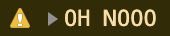
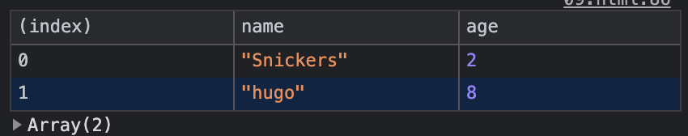
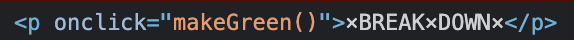
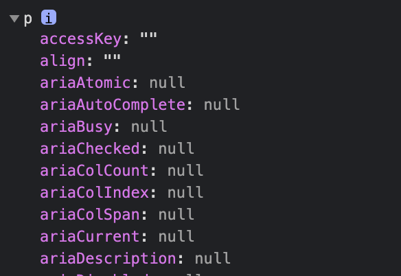
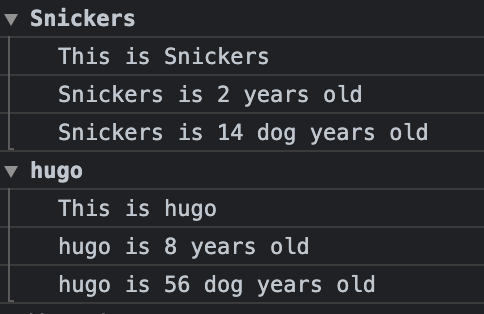
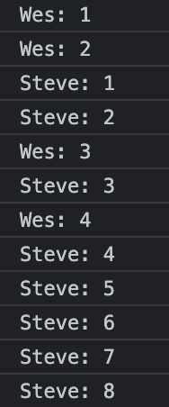
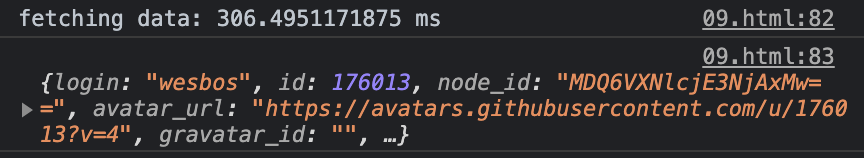

[Dev Tools Domination](https://2dowon.github.io/JavaScript30/html/09.html) 프로젝트의 핵심은 console 사용법이다.

## Regular

일반적으로 콘솔 창에서 확인하고 싶을 때는 `console.log()` 를 이용하면 된다

```jsx
console.log("hello");
// hello
```

## Interpolated

Interpolated는 한국어로 `보간`으로 두 점을 연결하는 방법을 의미한다.

> string을 문자열 안에 넣고 싶은 경우 `%s` 를 이용한다

```jsx
console.log("Hello I am a %s string!", "💩");
// Hello I am a 💩 string!
```

### 템플릿 리터럴

템플릿 리터럴은 내장된 표현식을 허용하는 문자열 리터럴이다. 템플릿 리터럴은 백틱```을 이용해서 표현식을 감싸줘야 하고, 사용하고자 하는 변수는`${}` 안에 쓰면 된다.

> 템플릿 리터럴을 이용

```jsx
const poo = "💩";
console.log(`Hello I am a ${poo} string!`);
// Hello I am a 💩 string!
```

## Styled

`%c` 를 이용하면 콘솔 텍스트에 스타일을 적용할 수 있다.

```jsx
console.log(
  "%c I am some great text",
  "font-size:50px; background:red; text-shadow: 10px 10px 0 blue"
);
```


## warning!

```jsx
console.warn("OH NOOO");
```



## Error

```jsx
console.error("Shit!");
```


## Info

```jsx
console.info("Crocodiles eat 3-4 people per year");
```

## Table

`console.table`은 표처럼 보여줄 수 있는 데이터를 표로 보여줄 때 사용한다.

```jsx
const dogs = [
  { name: "Snickers", age: 2 },
  { name: "hugo", age: 8 },
];
console.table(dogs);
```



## Testing

if 문을 사용하지 않고 콘솔 창에서 간단히 확인할 때 사용한다.

> `<p onClick="makeGreen()">×BREAK×DOWN×</p>`

```jsx
const p = document.querySelector("p");
console.assert(p.classList.contains("ouch"), "That is wrong!");
```


## Clearing

콘솔 창을 깨끗하게 만들 때 사용한다.

```jsx
console.clear();
```

## Viewing DOM Elements

DOM Elements를 보기 위해서 객체는 dir로 확인하고, 나머지 경우는 log로 확인하면 된다.

```jsx
console.log(p);
```



```jsx
console.dir(p);
```



## Grouping together

`console.group` 은 한 번 반복할 때마다 그룹으로 묶어서 확인하고 싶을 때 사용한다.

- 묶고 싶은 곳의 시작에서 `console.group`, 묶고 싶은 곳의 마지막에서 `console.groupEnd` 를 사용한다
- `console.group` 대신 `console.groupCollapsed`를 사용하면 드롭다운이 닫혀 있는 채로 콘솔에서 찍히게 되어 콘솔 창이 더 깔끔해보인다.

```jsx
const dogs = [
  { name: "Snickers", age: 2 },
  { name: "hugo", age: 8 },
];

dogs.forEach((dog) => {
  console.group(`${dog.name}`);
  // console.groupCollapsed(`${dog.name}`);
  console.log(`This is ${dog.name}`);
  console.log(`${dog.name} is ${dog.age} years old`);
  console.log(`${dog.name} is ${dog.age * 7} dog years old`);
  console.groupEnd(`${dog.name}`);
});
```



## Counting

`console.count`를 이용하면 같은 로그가 몇 번째 출력되고 있는지를 확인할 수 있다.

```jsx
console.count("Wes");
console.count("Wes");
console.count("Steve");
console.count("Steve");
console.count("Wes");
console.count("Steve");
console.count("Wes");
console.count("Steve");
console.count("Steve");
console.count("Steve");
console.count("Steve");
console.count("Steve");
```



## Timing

- `console.time`을 이용하면 실행되는데 걸리는 시간을 출력할 수 있다.
- 시간을 재기 시작하고 싶은 곳에 `console.time`, 시간 재는 것을 멈추고 싶은 곳에 `console.timeEnd`를 사용한다.

> fetch로 데이터를 가져오는데 걸리는 시간을 출력

```jsx
console.time("fetching data");
fetch("https://api.github.com/users/wesbos")
  .then((data) => data.json())
  .then((data) => {
    console.timeEnd("fetching data");
    console.log(data);
  });
```



<br>

# Ref.

- [14 Must Know Chrome Dev Tools Tricks - #JavaScript30 9/30](https://www.youtube.com/watch?v=xkzDaKwinA8&list=PLu8EoSxDXHP6CGK4YVJhL_VWetA865GOH&index=9)

- [JAVASCRIPT 30](https://2dowon.github.io/JavaScript30/)

- [(JavaScript) 입문자가 겪기 쉬운 console.log 실수](https://www.zerocho.com/category/JavaScript/post/5b2b45cf1350f9001b662ba6)
