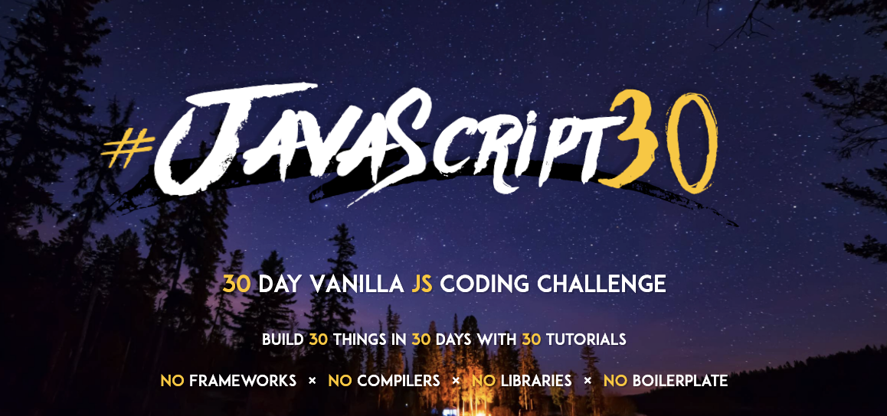

[JavaScript30](https://javascript30.com/)는 30일동안 하루에 한 개씩 Vanila JS(Frameworks, Compilers, Libraries, Boilerplate 등이 없는 순수 자바스크립트)를 이용해 총 30개의 결과물을 만드는 강의이다.

JavaScript 기본 문법이 어느정도 끝난 상황에서 JavaScript를 더 단단하게 만들기 위해 간단한 프로젝트를 찾아보는 중에 발견했다. 30개의 프로젝트를 통해 나의 JavaScript가 좀 더 단단해지기를 바라며 이 강의를 시작해보려고 한다.

JavaScript30를 진행하면서 현재 블로그에 각각의 프로젝트마다 간단한 후기를 작성 예정이다!

## JavaScript30 강의 듣는 방법

1. [JavaScript30](https://javascript30.com/) 홈페이지에서 이메일 가입을 하면 강의를 들을 수 있는 페이지와 Starter Files를 제공해준다.
2. 만약 가입하기 귀찮다면 [JavaScript30 GitHub](https://github.com/wesbos/JavaScript30)에서 코드(Starter Files)를 다운로드하고, 강의 영상은 [JavsScript30 Youtube](https://www.youtube.com/playlist?list=PLu8EoSxDXHP6CGK4YVJhL_VWetA865GOH)에서도 볼 수 있다.

 

# Ref.

- [JavaScript 30](https://javascript30.com/)

- [wesbos/JavaScript30(GitHub)](https://github.com/wesbos/JavaScript30)

- [JavaScript30 Youtube](https://www.youtube.com/playlist?list=PLu8EoSxDXHP6CGK4YVJhL_VWetA865GOH)
