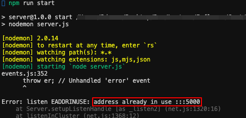
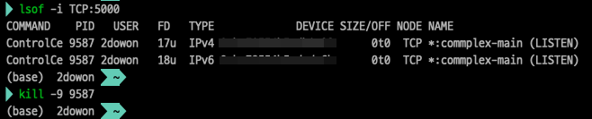
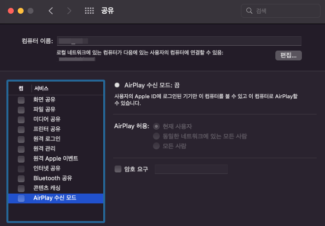
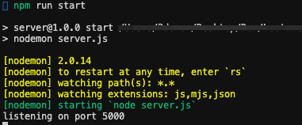

React의 테스트 코드 작성을 위해 Jest를 공부하면서 node를 잠깐 쓰게 되었는데, node 서버를 실행했는데 실행이 되지 않는 문제가 발생했다. 에러를 보니, 아래처럼 `address already in use :::5000` 였다. 즉, 이미 5000번 포트를 다른 프로세스에서 사용 중이기 때문에 실행할 수 없다는 뜻이다. 

해당 포트를 사용하던 Nodejs 프로세스가 비정상적으로 종료되는 경우에 나타날 수 있는 에러라고도 하지만, 사실 나는 node를 거의 처음 써보는 상태라 그럴리가 없는데 하면서 일단 사용중인 5000번 포트를 사용하고 있는 프로세스를 찾아서 강제종료해주기로 했다.

### Mac에서 특정 포트 찾아서 강제종료 하기

- `lsof -i :포트번호` ⇒ 특정 포트 찾기
- `kill -9 PID값` ⇒ 특정 포트를 사용하고 있는 프로세스 강제 종료하기
    
    ('-9'는 kill의 강제 종료 시그널인 9번을 사용한다는 의미)
    
    

    

### 🤔  종료해도 5000번 포트를 사용하는 프로세스가 계속 나온다?

문제의 시작은 여기였다. 보통은 위처럼 특정 포트를 사용하고 있는 프로세스를 찾아서 강제종료하면 해결되는 문제인데, 나의 경웨는 종료해도 종료해도 `lsof -i :포트번호` 명령어를 통해 다시 찾으면 계속 나오는 것이었다. (정말 좀비같은....) 

그래서 다시 보니까 보통은 `lsof -i :포트번호` 이 명령어로 프로세스를 찾게되면 COMMAND 부분이 node라고 나온다. 근데 나는 ControlCe라고 나오는 것이었다. 사실 위에서도 말했지만, 나는 이번이 node를 쓰는게 거의 처음이라서 이전에 nodejs에서 비정상적으로 종료될 일이 없었다...ㅎ

## ControlCe 5000번 포트 ⇒ Mac OS Monterey issue

그래서 ControlCe가 왜 5000번 포트를 사용하는지 알아봤더니 이번에 Mac OS를 Monterey로 업데이트했는데 그 때 생긴 이슈라고 한다. 

> 시스템 환결설정(setting) - 공유(sharing)
> 

이때 AirPlay 수신 모드가 체크되어있을텐데, 이를 체크 해제 해주면 된다. AirPlay 수신 모드가 5000번 포트를 사용하고 있었던 것이었다... 체크 해제 이후 다시 5000번 포트를 사용하고 있는지 확인한 결과 더 이상 5000번 포트를 사용하고 있는 프로세스가 발견되지 않았다.

 

# Ref.

- [[TIL] 에러노트📕 - [Node js] address already in use](https://velog.io/@nomadhash/TIL-%EC%97%90%EB%9F%AC%EB%85%B8%ED%8A%B8-Node-js-address-already-in-use)

- [Port 5000 already in use - MacOS Monterey issue](https://anandtripathi5.medium.com/port-5000-already-in-use-macos-monterey-issue-d86b02edd36c)