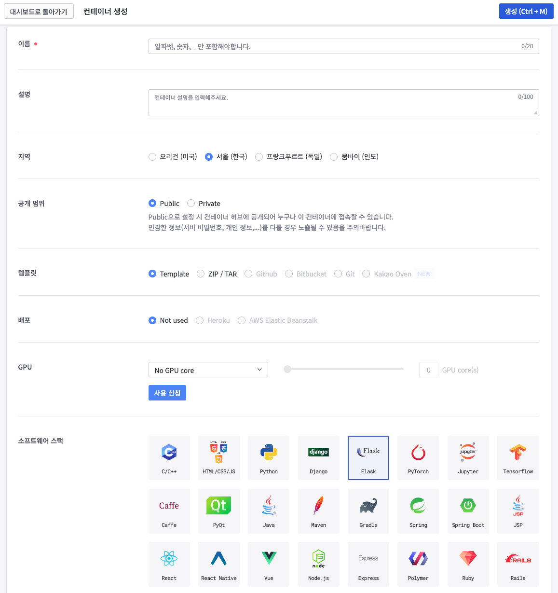
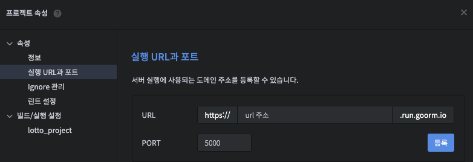
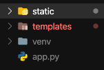
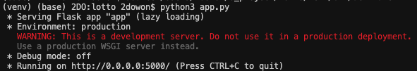

# FLASK 란

[Flask](https://flask.palletsprojects.com/en/1.1.x/) 는 파이썬 코드를 웹으로 구현하고 싶을 때 사용하는 파이썬 프레임워크 중 하나이다. 

보통은 Django(장고)를 많이 사용하지만, 현재 진행하는 프로젝트 기간 상 장고를 배우기에는 빠듯해 비교적 가벼운 Flask를 통해 웹 구현을 하고자 한다. 또한 Flask를 먼저 배우고, 장고로 넘어가면 장고를 배우기에도 훨씬 수월하다고 하니 Flask를 먼저 익히고, 장고로 넘어갈 계획이다.

</br>

# Flask 시작하기 전 세팅하기


## 가상환경 만들기

Flask나 Django(장고)를 사용하기 위해서는 가상환경이 필요하다. 가상환경은 내가 원하는 파이썬 환경을 구축하기 위해서 필요한 모듈만 담아 놓는 공간으로 같은 모듈을 사용하더라도 다른 버전이 필요한 경우, 여러 모듈을 설치하다가 충돌이 날 경우 등에 의해서 사용한다고 한다.

Python의 가상환경 만드는 방법은 다음과 같다.


1. Python3에서 제공하는 `venv` 라이브러리 사용하기  👍
    - venv 가상환경 생성하는 법
        1. 프로젝트 폴더(myproject) 만들기
            - Mac

            ```
            $ mkdir myproject
            $ cd myproject
            $ python3 -m venv venv
            ```

            - Window

            ```
            $ py -3 -m venv venv
            ```

        2. 환경 활성화하기
            - Mac

            ```
            $ . venv/bin/activate
            ```

            - Window

            ```
            > venv\Scripts\activate
            ```

        3. Flask 설치하기

        ```
        $ pip install Flask
        ```

2. `goormide` 이용하기

    [goormIDE - A Powerful Cloud IDE Service](https://ide.goorm.io/)

    - goormide 가상환경 생성하는 법

        

        - 컨테이너 이름 작성하고, 소트프웨어 스택을 `Flask` 로 설정
        - 다른 사람이 컨테이너에 접속하기를 원치 않는 경우에는 공개범위를 `Private` 으로 설정
        - 그 외에는 건들이지 않아도 된다
        - 생성 후에는 **프로젝트 → 실행 URL과 포트** 에 들어가서 PORT를 5000으로 설정하기 위해 URL을 따로 등록하고, 기존 URL은 삭제하고 새로운 URL을 적용하기

            


</br>

# Flask 시작하기

## Flask 폴더 구조



```
/app.py
/templates
	/index.html
/static
	/css
		/index.css
	/img
		/hello.jpg
```

- 플라스크를 통해 실행할 파이썬 파일
- `static` 폴더
: 이 폴더 안에 `css` `javascript` `img` 등의 폴더가 있고, 각각의 폴더 안에 해당 폴더에 맞는 파일이 존재
- `templates` 폴더

    : 이 폴더 안에 `html` 파일이 있다

</br>

⚠️ 위 트리 구조를 잘 지켜야된다!

⇒ `.py` 파일과 `static` 폴더,  `templates` 폴더가 같은 라인에 있어야 한다

</br>


## Flask 문법

### Flask application의 기본 형식

> app.py

```python
from flask import Flask
app = Flask(__name__)

@app.route('/')
def hello_world():
    return 'Hello, World!'

if __name__ == "__main__":
    app.run(host='0.0.0.0')
```

</br>

### Flask 실행하기

터미널에 `python3 [app.py](http://app.py)` 라고 적으면 실행할 수 있다

( 이때 app은 파이썬 파일의 이름으로 생성한 파이썬 파일의 이름 중 실행하고 싶은 파일 이름을 적으면 된다)



- 가상환경으로 실행한 경우라면 `[http://0.0.0.0:5000/](http://0.0.0.0:5000/)` 을 ctrl을 누르고 클릭하면 웹 페이지를 확인할 수 있다
- groomide에서 실행한 경우라면 `프로젝트 -> 실행 URL과 포트 -> URL 아래에 있는 url 이용`

    ⚠️ groomide는 url을 제공하기 때문에 고유한 url을 통해 웹페이지에 접근할 수 있다

</br>

### Flask 웹페이지 새로고침

Flask 웹페이지의 경우, 파일을 수정해도 캐시가 많이 쌓여서 수정한 상황을 바로바로 확인하는 것이 어려울 때가 많다. (특히 css) 그 때 `ctrl + shift + 상단의 '새로 고침' 버튼` 을 이용하면 캐시를 무시하기 때문에 변경 사항을 바로 확인할 수 있다

</br>

### Route 라우팅

`route()` 은 url을 연결할 때 사용

- `route('/')` 첫 화면을 보여줄 때
- url 경로는 반드시 `/` 로 시작해야 한다 
ex. `/lotto`

함수의 이름은 보통 route의 이름과 동일하게 설정한다

</br>

### HTML 렌더링

`render_template` 를 이용해서 HTML을 보여줄 수 있다

1. `render_template` import하기

    ```python
    from flask import Flask, **render_template**
    ```

2. 구현하고자 하는 HTML 파일을 templates 폴더 안에 만들기
3. Route로 연결해서 리턴하기

    ```python
    @app.route("/")
    def hello():
        return render_template("index.html")
    ```

    ⇒ 가상환경을 실행할 경우 index.html을 확인할 수 있다

(+) 링크를 통해 새로운 html을 보여주고 싶을 때

```python
@app.route("/new")
def new():
    return render_template("new.html") 
```

⇒ index.html 에서 `/new` 링크가 연결된 곳(`<a href="/new"></a>`)을 클릭하면 new.html을 확인할 수 있다

</br>

### html 파일에서 사용하는 Flask 문법

- css 파일을 연결할 때

    ```html
    <link rel="stylesheet" href="{{ url_for('static', filename='css/CSS 파일 이름.css') }}" />
    ```

- 이미지를 넣을 때

    ```html
    
    ```

- 버튼을 클릭했을 때 파이썬 코드와 연결되기 위해서

    ```html
    <button onclick="window.location.href='{{ url_for( '라우터 이름') }}';"></button>
    ```

    ⚠️ 이 때 파이썬 코드에서 변수를 사용한다면!

    - html 파일에서는 변수를 중괄호 두 번으로 감싸서 `{{ 변수이름 }}` 이렇게 사용해야 한다
    - python 파일에서도 변수를 사용하는 함수에서 리턴할 때 변수를 따로 설정해야 한다
    - 웹에서 "랜덤 로또 번호" 버튼을 누르면 1부터 45번까지 번호 중 랜덤으로 6개의 번호를 추출하는 함수가 실행되는 경우

        > app.py

        ```python
        @app.route("/randomLotto")
        def randomLotto():
            lotto = sorted(random.sample(range(1, 46), 6))
            return render_template("index.html", variable=lotto) 
        ```

        > index.html

        ```python
        <div class="tabs clearfix lottoBtns" data-tabgroup="first-tab-group">
        		<button id="tab1" class="button" onclick="window.location.href='{{ url_for( 'randomLotto') }}';">랜덤 로또 번호</button>
        </div>
        <p class="ball_container">
        		<span class="ball_645 lrg ball1">{{ variable[0] }}</span>
        		<span class="ball_645 lrg ball2">{{ variable[1] }}</span>
        		<span class="ball_645 lrg ball3">{{ variable[2] }}</span>
        		<span class="ball_645 lrg ball4">{{ variable[3] }}</span>
        		<span class="ball_645 lrg ball5">{{ variable[4] }}</span>
        		<span class="ball_645 lrg ball6">{{ variable[5] }}</span>
        </p>
        ```