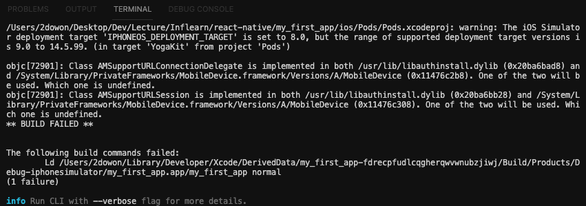
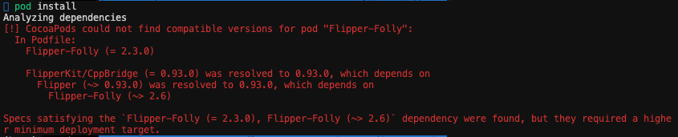
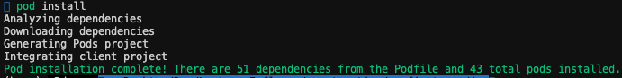
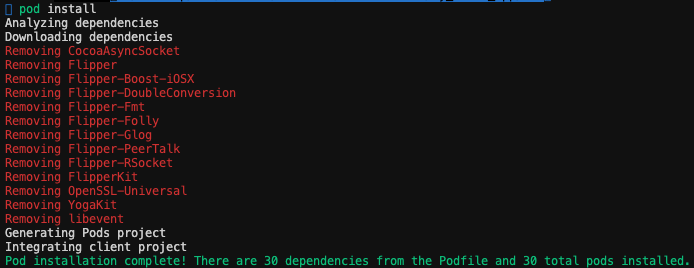
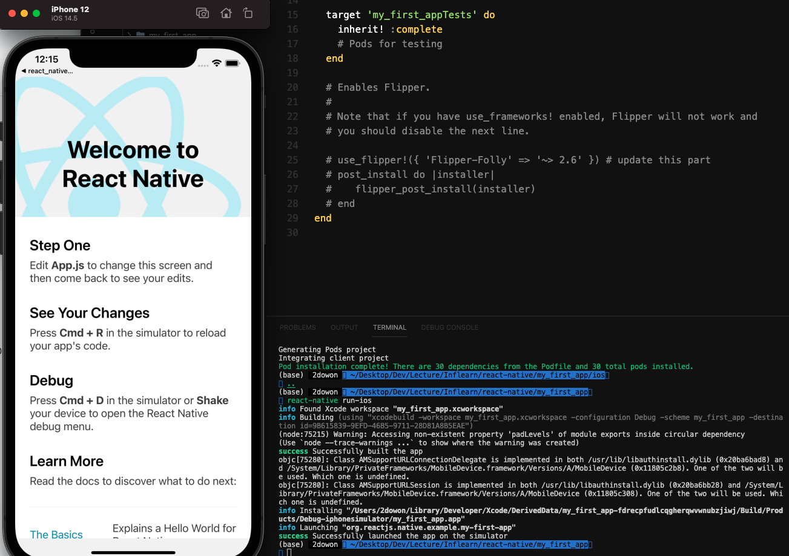

ReactNative를 이용해 앱을 만들 일이 생겼고, 그 덕분에 오랜만에 새로운 언어를 설치했다. 개발의 반은 제대로된 설치와 환경변수 설정이라고 누가 그랬던가... 프로젝트를 생성하고 iOS Simulator를 실행하자마자 몇백줄의 에러가 쏟아졌다.

결국 해결하긴 했지만, 해결했다고 말하기에는 에러가 발생하는 코드를 삭제했던거라 약간은 찜찜하다. 그래도 몇 시간의 삽질 끝에 실행에 성공해서 행복하다ㅜㅜ 진짜 cocoapods만 몇번 재설치했는지 모르겠다 ㅎ

(아, 참고로 저는 인프런에서 강의를 들으면서 React Native를 설치했는데 해당 강의에서는 특정 버전(0.61.5)으로 프로젝트를 설치하기를 권장하고 있습니다. 그래서 저도 처음에는 특정 버전으로 프로젝트를 설치했으나 해당 버전에는 아래 수정하는 `use_flipper` 의 코드 자체가 존재하지 않고 결국 최신 버전으로 프로젝트를 설치했습니다. 만약 특정 버전을 사용하는 경우에는 저는 개인적으로 해당 버전에서는 해결책을 찾지 못했으니 가능하면 최신 버전으로 설치하세여....)

</br>

## `react-native run-ios` 를 실행하자마 얻은 에러



엄청 길게 쓰여져 있지만, 결국 빌드가 실패했다는 말이다.  이 에러를 해결하기 위해 구글링을 시작했고, ReactNative버전이 업데이트됨에 따라 `use_flipper` 의 코드 수정이 필요했다.

✅   `use_flipper` 의 코드는 ios 폴더 아래 Podfile 안에 있다. Podfile을 수정한 이후에는 반드시 ios 폴더 아래에서 `pod install` 을 통해 변경사항을 적용해줘야 한다. 적용한 이후에 다시 프로젝트 폴더 아래로 돌아와 `react-native run-ios` 명령어로 잘 되는지 확인!

## 첫 번째 시도 ⇒ 실패

구글링 했을 때 제일 많이 볼 수 있는 해결책이다. 글들을 보면 2021년 상반기까지는 아래 해결책으로 해결됐던거 같은데...ㅜㅜ

### ios - Podfile

> 기존

```bash
use_flipper!()

post_install do |installer|
    react_native_post_install(installer)
end
```

> 수정

```bash
use_flipper!({ 'Flipper-Folly' => '2.3.0' }) # update this part
post_install do |installer|
    flipper_post_install(installer)
end
```

> 2021.08.25 기준 아래와 같은 에러가 발생했다




## 두 번째 시도  ⇒ 실패

위 에러에서 Flipper-Folly의 버전이 틀렸다고 뭐라고 하고 있으니 버전을 수정해봤다.

> 수정 ⇒ 2.3.0에서 ~> 2.6으로 수정

```bash
use_flipper!({ 'Flipper-Folly' => '~> 2.6' }) # update this part
post_install do |installer|
    flipper_post_install(installer)
end
```

> 수정 후 `pod install`을 한 결과




느낌이 좋았다. 하지만 `react-native run-ios` 를 실행하면 맨 위 에러와 같은 에러가 발생한다....

## 세 번째 시도  ⇒ 성공

과감하게 `use_flipper` 관련 코드를 다 삭제했다. 일단 당장은 쓸 일이 없고, ios를 실행하는 것이 더 중요하다 ㅜㅜ

```bash
# use_flipper!({ 'Flipper-Folly' => '~> 2.6' }) # update this part
# post_install do |installer|
#    flipper_post_install(installer)
# end
```

> `use_flipper` 코드를 주석 처리 후 pod install을 하자 관련 dependencies들이 다 제거되었다.




> 드디어 React Native가 날 반겨준다...😭




</br>

# Ref.

- [[RN 에러노트🔥] The following build commands failed: CompileC /Users/dody/Library/Developer/Xcode/DerivedData/oheadline_client-bntjzlxfwpoksjdlhzqejhufjwdn/Buil...](https://velog.io/@dody_/RN-%EC%97%90%EB%9F%AC%EB%85%B8%ED%8A%B8-The-following-build-commands-failedCompileC-UsersdodyLibraryDeveloperXcodeDerivedDataoheadlineclient-bntjzlxfwpoksjdlhzqejhufjwdnBuil)

- [[ React Native -삽질 기록 ] react-native run-ios 오류 해결 ( CompileC , load 에러 , Failed to build iOS project. We ran "xcodebuild" command but it exited with error code 65. , pod install, pod update , M1 빌드 오류)](https://kagus2.tistory.com/24)