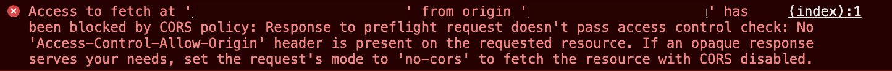

프로젝트를 진행하면서 CORS 에러를 지겹도록 봤지만, 서버에서 주로 해결을 하다보니 프론트인 나는 따로 정리를 해두지 않아서 이번에 가볍게 정리를 해두려고 한다.

# CORS (Cross-Origin Resource Sharing)

클라이언트와 서버가 요청과 응답을 주고받다보면 위와같은 CORS 에러를 종종 볼 수 있다.

### CORS란

CORS 에러는 브라우저에서 다른 출처의 리소스를 가져오는 것을 제한하는 보안 방식이자 브라우저에서 다른 출처의 리소스를 공유할 수 있는 방법이라고도 볼수 있다.

### 같은 출처

같은 출처이기 위해서는 Protocal, Host, Port 세가지가 모두 동일해야만 한다. 하지만 클라이언트와 서버가 같은 출처이기는 쉽지 않다. (예를 들어, 우리 서비스는 리액트와 스프링을 이용했는데, 리액트의 포트는 3000이고, 스프링의 포트는 8080이기에 통신할 때 CORS에러가 발생했다.)

### 동일 출처 정책

CORS 에러는 브라우저가 CORS 동일 출처 정책을 지킴에 따라 다른 출처의 리소스 접근을 금지하기 때문에 발생했는데, 그렇다면 동일 출처 정책이 왜 필요한 것일까?🤔

동일 출처 정책을 지키면 외부 리소스를 가져오지 못해 불편하지만, 동일 출처 정책은 XSS나 XSRF 등의 보안 취약점을 노린 공격을 방어할 수 있기 때문이다.

### CORS 에러 해결방법

CORS 에러의 해결 방법은 다양하다. 클라이언트에서도 할 수 있고, 서버에서도 할 수 있다.

> 클라이언트
> 

CORS 에러는 서버가 있다면 서버에서 해결하는 것이 가장 좋지만, 자체 서버가 없는 경우라면 클라이언트에서 CORS 에러를 직접 해결해야 한다. 이 경우에는 **Proxy 서버 설정**을 통해 해결할 수 있다.

Proxy는 다양한 이유로 직접 통신하지 못하는 두 개의 컴퓨터 사이에 서로 통신할 수 있도록 돕는 역할이다.

이 외에도 JSONP(JSON with Padding) 방법도 있다. 하지만 GET 방식만 가능하고, 서버에서 JSONP를 지원하지 않으면 사용할 수 없다는 단점이 존재한다.

> 서버
> 

서버에서 특정 도메인 혹은 모든 도메인을 허용하도록 설정을 해주면 된다. 설정은 Access-Control-allow-origin 헤더를 추가하면 된다.

# Ref.

- [교차 출처 리소스 공유 (CORS) - HTTP | MDN](https://developer.mozilla.org/ko/docs/Web/HTTP/CORS)

- [[Browser] CORS란?](https://beomy.github.io/tech/browser/cors/)

- [지긋지긋한 CORS 파헤쳐보자](https://velog.io/@jmkim87/%EC%A7%80%EA%B8%8B%EC%A7%80%EA%B8%8B%ED%95%9C-CORS-%ED%8C%8C%ED%97%A4%EC%B3%90%EB%B3%B4%EC%9E%90)

- [Same-Origin Policy 동일 출처 정책과 CORS 에러](https://velog.io/@yejinh/CORS-4tk536f0db)